# Architecture Documentation - Envoy Gateway Docker Desktop Extension

## Table of Contents
1. [System Overview](#system-overview)
2. [Component Architecture](#component-architecture)
3. [Data Flow](#data-flow)
4. [Security Architecture](#security-architecture)
5. [Deployment Architecture](#deployment-architecture)
6. [Integration Points](#integration-points)
7. [Scalability & Performance](#scalability--performance)
8. [Monitoring & Observability](#monitoring--observability)

---

## 1. System Overview

### 1.1 High-Level Architecture

The Envoy Gateway Docker Desktop Extension follows a microservices architecture with clear separation of concerns:

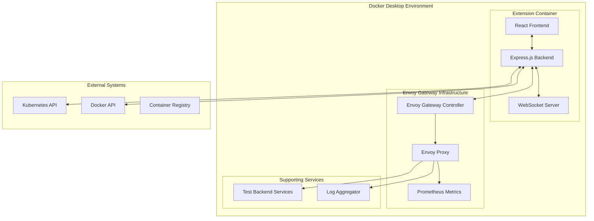

### 1.2 Design Principles

1. **Separation of Concerns**: Clear boundaries between UI, business logic, and infrastructure
2. **Microservices**: Small, focused services with single responsibilities
3. **Event-Driven**: Real-time updates through WebSocket events
4. **API-First**: Well-defined REST API with comprehensive documentation
5. **Extensibility**: Plugin architecture for custom integrations
6. **Observability**: Built-in monitoring, logging, and tracing
7. **Security**: Zero-trust architecture with comprehensive security controls

---

## 2. Component Architecture

### 2.1 Frontend Architecture

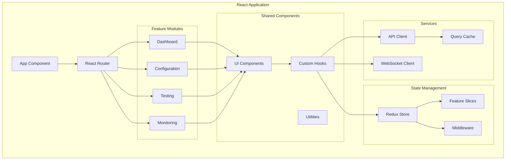

#### Frontend Stack
- **Framework**: React 18 with TypeScript
- **State Management**: Redux Toolkit with RTK Query
- **UI Framework**: Material-UI 5
- **Routing**: React Router v6
- **Form Handling**: React Hook Form with Yup validation
- **Charts**: Recharts for metrics visualization
- **Code Editor**: Monaco Editor for YAML editing

### 2.2 Backend Architecture

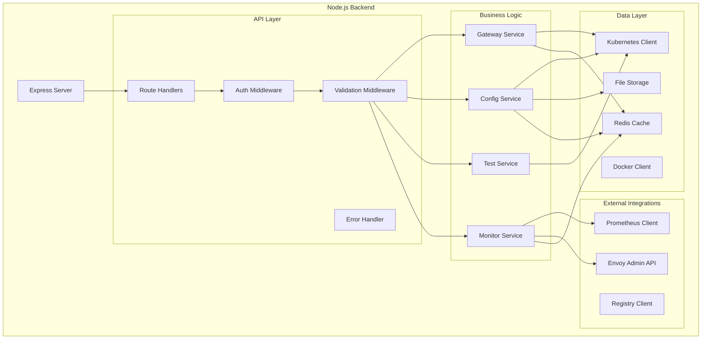

#### Backend Stack
- **Runtime**: Node.js 18+ with TypeScript
- **Framework**: Express.js with async/await
- **Validation**: Joi for request validation
- **ORM**: None (direct API clients)
- **Cache**: Redis for performance optimization
- **Monitoring**: Prometheus client for metrics
- **Logging**: Winston with structured logging

### 2.3 Envoy Gateway Integration

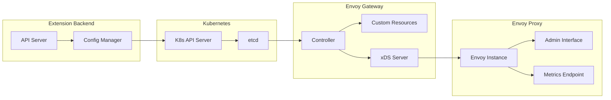

---

## 3. Data Flow

### 3.1 Configuration Management Flow

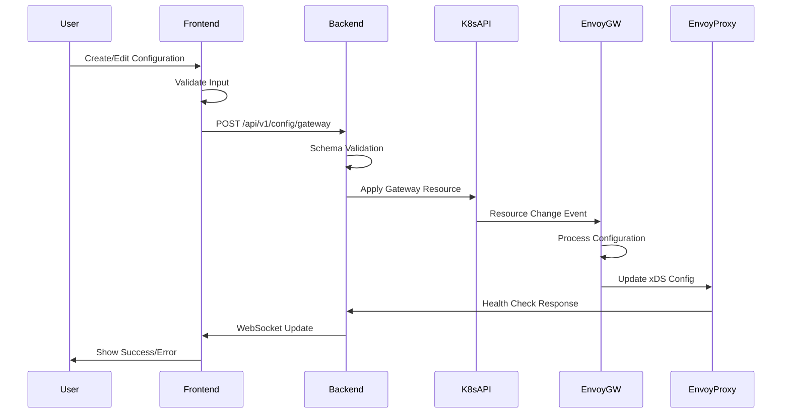

### 3.2 Testing Flow

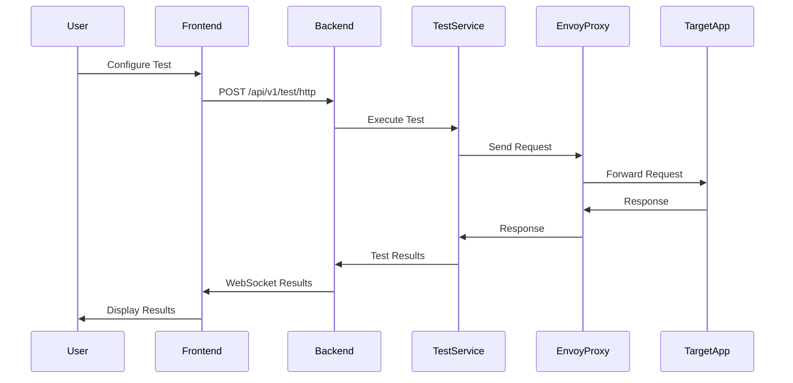

### 3.3 Monitoring Data Flow

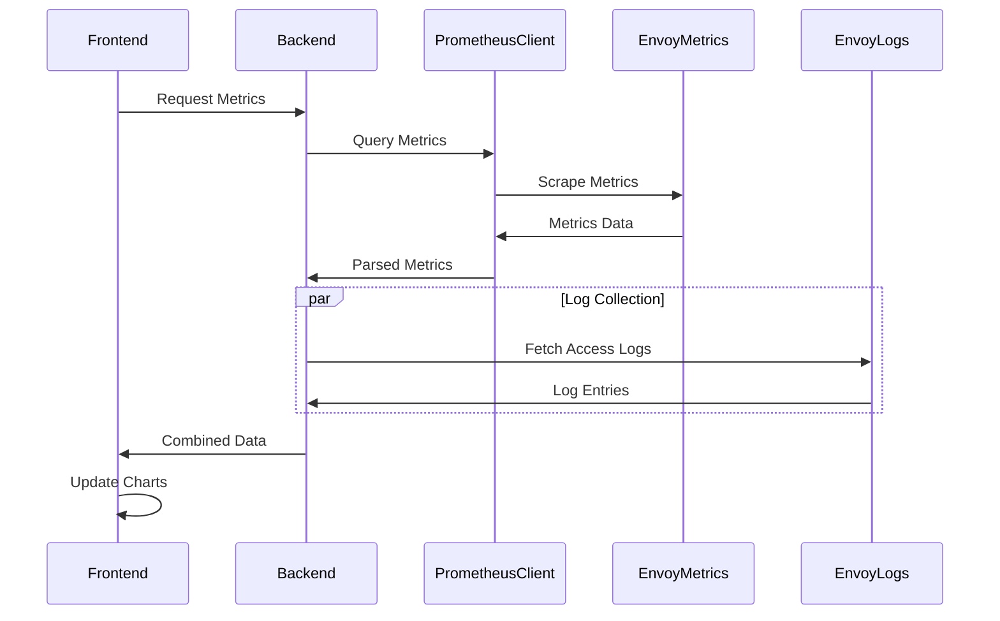

---

## 4. Security Architecture

### 4.1 Security Layers

```mermaid
graph TD
    subgraph "Security Layers"
        AUTH[Authentication Layer]
        AUTHZ[Authorization Layer]
        NET[Network Security]
        DATA[Data Security]
        AUDIT[Audit Layer]
    end
    
    subgraph "Authentication"
        JWT[JWT Tokens]
        API_KEY[API Keys]
        OAUTH[OAuth 2.0]
    end
    
    subgraph "Authorization"
        RBAC[Role-Based Access]
        POLICY[Policy Engine]
        PERMISSIONS[Permission Matrix]
    end
    
    subgraph "Network"
        TLS[TLS/HTTPS]
        CORS[CORS Policy]
        RATE[Rate Limiting]
    end
    
    subgraph "Data"
        ENCRYPT[Encryption at Rest]
        TRANSIT[Encryption in Transit]
        SECRETS[Secret Management]
    end
    
    AUTH --> JWT
    AUTH --> API_KEY
    AUTH --> OAUTH
    
    AUTHZ --> RBAC
    AUTHZ --> POLICY
    AUTHZ --> PERMISSIONS
    
    NET --> TLS
    NET --> CORS
    NET --> RATE
    
    DATA --> ENCRYPT
    DATA --> TRANSIT
    DATA --> SECRETS
```

### 4.2 Security Controls

#### Authentication & Authorization
- **JWT-based authentication** with configurable expiration
- **Role-based access control** (Admin, Developer, Viewer)
- **API key authentication** for programmatic access
- **Multi-factor authentication** support via Docker Desktop

#### Network Security
- **TLS 1.3** for all external communications
- **mTLS** for service-to-service communication
- **CORS policies** restricting origins
- **Rate limiting** per API key/IP
- **Request validation** and sanitization

#### Data Protection
- **Encryption at rest** for sensitive configuration data
- **Vault integration** for secret management
- **Data anonymization** in logs and metrics
- **Secure key rotation** mechanisms

### 4.3 Security Implementation

```typescript
// Authentication middleware
export const authenticate = async (req: Request, res: Response, next: NextFunction) => {
    const token = extractToken(req);
    
    if (!token) {
        return res.status(401).json({ error: 'No token provided' });
    }
    
    try {
        const decoded = jwt.verify(token, process.env.JWT_SECRET);
        req.user = decoded;
        next();
    } catch (error) {
        return res.status(401).json({ error: 'Invalid token' });
    }
};

// Authorization middleware
export const authorize = (requiredRole: Role) => {
    return (req: Request, res: Response, next: NextFunction) => {
        if (!req.user || !hasRole(req.user, requiredRole)) {
            return res.status(403).json({ error: 'Insufficient permissions' });
        }
        next();
    };
};

// Input validation
export const validateRequest = (schema: Schema) => {
    return (req: Request, res: Response, next: NextFunction) => {
        const { error } = schema.validate(req.body);
        if (error) {
            return res.status(400).json({ 
                error: 'Validation failed',
                details: error.details
            });
        }
        next();
    };
};
```

---

## 5. Deployment Architecture

### 5.1 Container Architecture

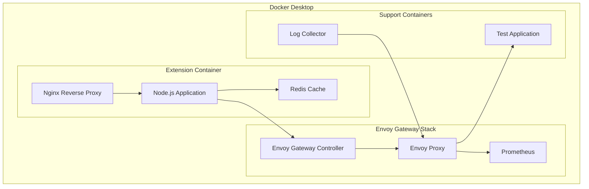

### 5.2 Docker Compose Configuration

```yaml
# docker-compose.yml
version: '3.8'

services:
  extension-app:
    build: .
    ports:
      - "3000:3000"
    environment:
      - NODE_ENV=production
      - REDIS_URL=redis://redis:6379
    depends_on:
      - redis
      - envoy-gateway
    volumes:
      - ./config:/app/config
      - /var/run/docker.sock:/var/run/docker.sock

  redis:
    image: redis:7-alpine
    command: redis-server --appendonly yes
    volumes:
      - redis-data:/data

  envoy-gateway:
    image: envoyproxy/gateway:v1.2.0
    ports:
      - "8080:8080"
      - "8443:8443"
    environment:
      - ENVOY_GATEWAY_NAMESPACES=default
    volumes:
      - ./envoy-config:/etc/envoy-gateway

  envoy-proxy:
    image: envoyproxy/envoy:v1.28.0
    ports:
      - "9901:9901"  # Admin interface
    command: >
      envoy -c /etc/envoy/envoy.yaml
      --service-cluster envoy-gateway
      --service-node envoy-gateway
    volumes:
      - ./envoy-config:/etc/envoy

  prometheus:
    image: prom/prometheus:latest
    ports:
      - "9090:9090"
    volumes:
      - ./prometheus.yml:/etc/prometheus/prometheus.yml
      - prometheus-data:/prometheus

  test-backend:
    image: kennethreitz/httpbin
    ports:
      - "8888:80"

volumes:
  redis-data:
  prometheus-data:
```

### 5.3 Kubernetes Deployment (Optional)

For users who prefer Kubernetes mode:

```yaml
# k8s-manifests/envoy-gateway.yaml
apiVersion: apps/v1
kind: Deployment
metadata:
  name: envoy-gateway-extension
  namespace: envoy-gateway-system
spec:
  replicas: 1
  selector:
    matchLabels:
      app: envoy-gateway-extension
  template:
    metadata:
      labels:
        app: envoy-gateway-extension
    spec:
      containers:
      - name: extension
        image: envoyproxy/envoy-gateway-extension:latest
        ports:
        - containerPort: 3000
        env:
        - name: KUBERNETES_MODE
          value: "true"
        - name: KUBECONFIG
          value: "/etc/kubeconfig/config"
        volumeMounts:
        - name: kubeconfig
          mountPath: /etc/kubeconfig
          readOnly: true
      volumes:
      - name: kubeconfig
        secret:
          secretName: kubeconfig
```

---

## 6. Integration Points

### 6.1 Docker Desktop Integration

```typescript
// Docker API integration
export class DockerIntegration {
    private docker: Docker;

    constructor() {
        this.docker = new Docker({
            socketPath: process.platform === 'win32' 
                ? '//./pipe/docker_engine'
                : '/var/run/docker.sock'
        });
    }

    async deployEnvoyGateway(config: DeploymentConfig): Promise<DeploymentResult> {
        const containers = await this.createContainers(config);
        const network = await this.createNetwork();
        await this.connectContainers(containers, network);
        return { containers, network };
    }

    async getContainerLogs(containerId: string): Promise<LogStream> {
        return this.docker.getContainer(containerId).logs({
            stdout: true,
            stderr: true,
            follow: true,
            timestamps: true
        });
    }
}
```

### 6.2 Kubernetes API Integration

```typescript
// Kubernetes API client
export class KubernetesIntegration {
    private k8sApi: k8s.CoreV1Api;
    private customApi: k8s.CustomObjectsApi;

    constructor() {
        const kc = new k8s.KubeConfig();
        kc.loadFromDefault();
        
        this.k8sApi = kc.makeApiClient(k8s.CoreV1Api);
        this.customApi = kc.makeApiClient(k8s.CustomObjectsApi);
    }

    async createGateway(gateway: Gateway): Promise<Gateway> {
        const response = await this.customApi.createNamespacedCustomObject(
            'gateway.networking.k8s.io',
            'v1',
            gateway.metadata.namespace,
            'gateways',
            gateway
        );
        return response.body as Gateway;
    }

    async watchGatewayEvents(callback: (event: any) => void): Promise<void> {
        const watch = new k8s.Watch(this.k8sApi.kubeConfig);
        
        watch.watch('/apis/gateway.networking.k8s.io/v1/gateways',
            {},
            callback,
            (err) => {
                console.error('Watch error:', err);
            }
        );
    }
}
```

### 6.3 Envoy Admin API Integration

```typescript
// Envoy Admin API client
export class EnvoyAdminClient {
    private baseUrl: string;

    constructor(adminUrl: string) {
        this.baseUrl = adminUrl;
    }

    async getConfig(): Promise<EnvoyConfig> {
        const response = await fetch(`${this.baseUrl}/config_dump`);
        return response.json();
    }

    async getStats(filter?: string): Promise<EnvoyStats> {
        const url = filter 
            ? `${this.baseUrl}/stats?filter=${filter}`
            : `${this.baseUrl}/stats`;
        
        const response = await fetch(url);
        const text = await response.text();
        return this.parseStats(text);
    }

    async getClusters(): Promise<ClusterInfo[]> {
        const response = await fetch(`${this.baseUrl}/clusters?format=json`);
        return response.json();
    }

    async getAccessLogs(): Promise<AccessLog[]> {
        const response = await fetch(`${this.baseUrl}/access_log_dump`);
        const text = await response.text();
        return this.parseAccessLogs(text);
    }
}
```

---

## 7. Scalability & Performance

### 7.1 Performance Characteristics

#### Response Time Targets
- **UI Interactions**: < 100ms
- **API Responses**: < 500ms (90th percentile)
- **Configuration Changes**: < 2s end-to-end
- **Metric Queries**: < 1s
- **Dashboard Load**: < 2s

#### Throughput Targets
- **API Requests**: 1000 req/min sustained
- **WebSocket Connections**: 100 concurrent
- **Metric Updates**: 10Hz refresh rate
- **Log Processing**: 10K logs/minute

### 7.2 Caching Strategy

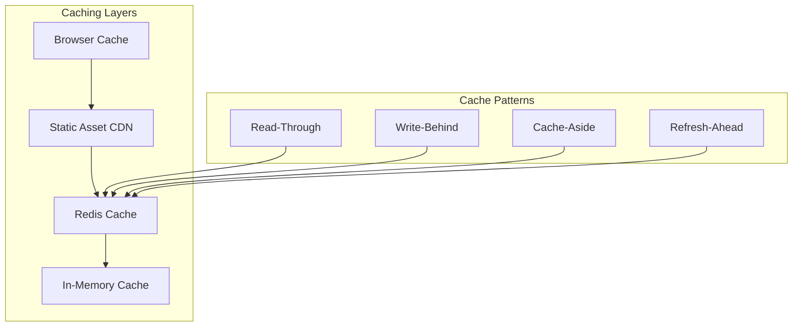

#### Cache Implementation

```typescript
// Multi-level caching
export class CacheManager {
    private redisClient: Redis;
    private memoryCache: NodeCache;

    constructor() {
        this.redisClient = new Redis(process.env.REDIS_URL);
        this.memoryCache = new NodeCache({ stdTTL: 300 }); // 5 min TTL
    }

    async get<T>(key: string): Promise<T | null> {
        // L1: Memory cache
        const memResult = this.memoryCache.get<T>(key);
        if (memResult) return memResult;

        // L2: Redis cache
        const redisResult = await this.redisClient.get(key);
        if (redisResult) {
            const parsed = JSON.parse(redisResult);
            this.memoryCache.set(key, parsed);
            return parsed;
        }

        return null;
    }

    async set<T>(key: string, value: T, ttl: number = 3600): Promise<void> {
        // Write to both caches
        this.memoryCache.set(key, value, ttl);
        await this.redisClient.setex(key, ttl, JSON.stringify(value));
    }

    async invalidate(pattern: string): Promise<void> {
        // Clear memory cache
        this.memoryCache.flushAll();
        
        // Clear Redis cache
        const keys = await this.redisClient.keys(pattern);
        if (keys.length > 0) {
            await this.redisClient.del(...keys);
        }
    }
}
```

### 7.3 Horizontal Scaling

While the extension runs in a single container per Docker Desktop instance, the architecture supports horizontal scaling for multi-instance deployments:

- **Stateless Backend**: API servers can be load-balanced
- **Shared Cache**: Redis for session/state sharing
- **Event Broadcasting**: Redis pub/sub for coordination
- **Database Sharding**: Support for multiple K8s clusters

---

## 8. Monitoring & Observability

### 8.1 Observability Stack

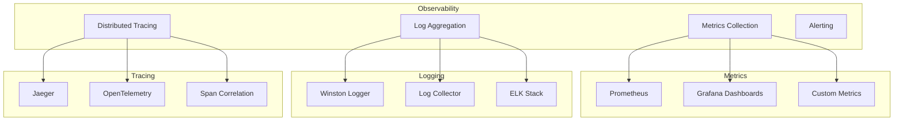

### 8.2 Key Metrics

#### Application Metrics
- Request count and rate
- Response time percentiles
- Error rate and types
- Active connections
- Cache hit/miss ratio
- Resource utilization (CPU, memory)

#### Business Metrics
- Configuration deployments
- Test executions
- User sessions
- Feature usage
- Error categorization

#### Infrastructure Metrics
- Container health
- Network latency
- Disk I/O
- Database connections
- External API response times

### 8.3 Monitoring Implementation

```typescript
// Metrics collection
export class MetricsCollector {
    private prometheus: prom.Registry;
    private httpDuration: prom.Histogram<string>;
    private httpRequests: prom.Counter<string>;
    private activeConnections: prom.Gauge<string>;

    constructor() {
        this.prometheus = new prom.Registry();
        
        this.httpDuration = new prom.Histogram({
            name: 'http_request_duration_seconds',
            help: 'HTTP request duration in seconds',
            labelNames: ['method', 'route', 'status_code'],
            buckets: [0.1, 0.5, 1, 2, 5, 10]
        });

        this.httpRequests = new prom.Counter({
            name: 'http_requests_total',
            help: 'Total number of HTTP requests',
            labelNames: ['method', 'route', 'status_code']
        });

        this.activeConnections = new prom.Gauge({
            name: 'websocket_connections_active',
            help: 'Number of active WebSocket connections'
        });

        this.prometheus.registerMetric(this.httpDuration);
        this.prometheus.registerMetric(this.httpRequests);
        this.prometheus.registerMetric(this.activeConnections);
    }

    recordRequest(method: string, route: string, statusCode: number, duration: number) {
        this.httpRequests.inc({ method, route, status_code: statusCode.toString() });
        this.httpDuration.observe({ method, route, status_code: statusCode.toString() }, duration);
    }

    incrementActiveConnections() {
        this.activeConnections.inc();
    }

    decrementActiveConnections() {
        this.activeConnections.dec();
    }

    async getMetrics(): Promise<string> {
        return this.prometheus.metrics();
    }
}
```

### 8.4 Alerting Rules

```yaml
# alerting-rules.yml
groups:
  - name: extension-alerts
    rules:
      - alert: HighErrorRate
        expr: rate(http_requests_total{status_code=~"5.."}[5m]) > 0.1
        for: 2m
        labels:
          severity: warning
        annotations:
          summary: "High error rate detected"
          description: "Error rate is above 10% for the last 5 minutes"

      - alert: DatabaseConnectionFailure
        expr: up{job="envoy-gateway-extension"} == 0
        for: 1m
        labels:
          severity: critical
        annotations:
          summary: "Extension service is down"
          description: "The Envoy Gateway extension service has been down for more than 1 minute"

      - alert: MemoryUsageHigh
        expr: process_resident_memory_bytes > 1073741824  # 1GB
        for: 5m
        labels:
          severity: warning
        annotations:
          summary: "High memory usage"
          description: "Memory usage is above 1GB for the last 5 minutes"
```

---

## Conclusion

This architecture document provides a comprehensive view of the Envoy Gateway Docker Desktop Extension's design. The architecture emphasizes:

1. **Modularity**: Clear separation of concerns with well-defined interfaces
2. **Scalability**: Designed to handle increasing load and complexity
3. **Security**: Multiple layers of security controls and best practices
4. **Observability**: Comprehensive monitoring and debugging capabilities
5. **Maintainability**: Clean code structure with extensive testing
6. **Performance**: Optimized for responsiveness and efficient resource usage

The architecture supports both immediate needs and future growth, providing a solid foundation for the extension's development and operation.
