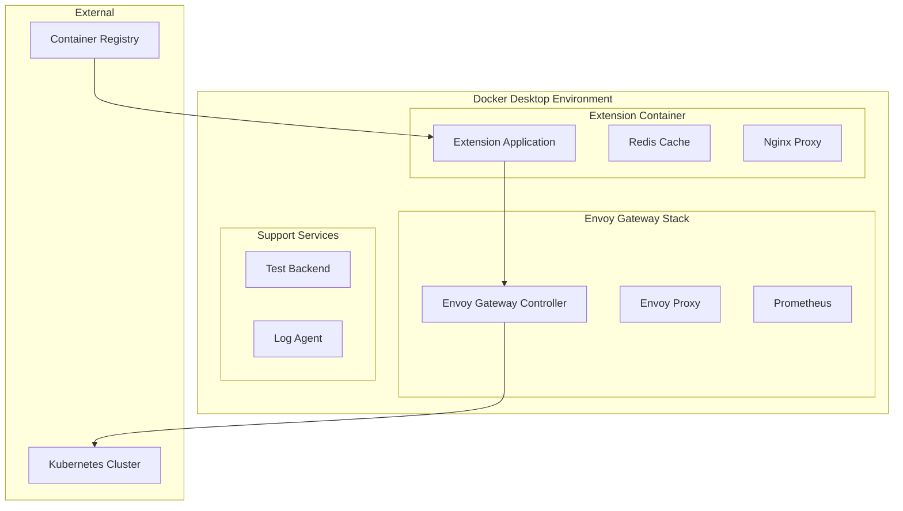

# Deployment Guide - Envoy Gateway Docker Desktop Extension

## Table of Contents
1. [Deployment Overview](#deployment-overview)
2. [Prerequisites](#prerequisites)
3. [Build Process](#build-process)
4. [Local Development Deployment](#local-development-deployment)
5. [Production Deployment](#production-deployment)
6. [Docker Desktop Marketplace](#docker-desktop-marketplace)
7. [Configuration Management](#configuration-management)
8. [Monitoring & Health Checks](#monitoring--health-checks)
9. [Updates & Rollbacks](#updates--rollbacks)
10. [Troubleshooting](#troubleshooting)

---

## 1. Deployment Overview

### 1.1 Deployment Architecture

The Envoy Gateway Docker Desktop Extension follows a containerized deployment model with the following components:



### 1.2 Deployment Modes

1. **Development Mode**: Local development with hot reloading
2. **Testing Mode**: Isolated testing environment with test data
3. **Production Mode**: Optimized for Docker Desktop marketplace distribution
4. **Standalone Mode**: Run outside Docker Desktop (experimental)

### 1.3 Deployment Targets

- **Docker Desktop Marketplace**: Primary distribution channel
- **GitHub Releases**: Manual installation packages
- **Private Registry**: Enterprise deployments
- **Local Development**: Developer workstations

---

## 2. Prerequisites

### 2.1 System Requirements

#### Docker Desktop
- Docker Desktop 4.8.0 or higher
- Kubernetes enabled (optional, for K8s mode)
- Extensions feature enabled

#### Host System
- **Memory**: Minimum 4GB, Recommended 8GB
- **CPU**: 2+ cores
- **Storage**: 2GB free space
- **Network**: Internet access for pulling images

#### Development Prerequisites
- Node.js 18+ with npm/yarn
- Docker CLI
- Docker Buildx (for multi-platform builds)
- Docker Extensions CLI

### 2.2 Installation Commands

```bash
# Install Docker Extensions CLI
curl -L https://github.com/docker/extensions-sdk/releases/latest/download/docker-extension-cli-desktop-linux.tar.gz | tar -xz
sudo mv docker-extension /usr/local/bin/

# Verify installation
docker extension version
```

---

## 3. Build Process

### 3.1 Build Configuration

The build process is configured in `package.json` and uses Docker multi-stage builds for optimization.

```json
{
  "scripts": {
    "build": "npm run build:frontend && npm run build:backend",
    "build:frontend": "cd src/frontend && npm run build",
    "build:backend": "cd src/backend && npm run build",
    "build:docker": "docker buildx build --platform linux/amd64,linux/arm64 -t envoy-gateway-extension .",
    "build:extension": "docker extension pack envoy-gateway-extension",
    "build:all": "npm run build && npm run build:docker && npm run build:extension"
  }
}
```

### 3.2 Multi-Stage Dockerfile

```dockerfile
# Dockerfile
# Stage 1: Frontend Build
FROM node:18-alpine AS frontend-builder
WORKDIR /app/frontend
COPY src/frontend/package*.json ./
RUN npm ci --only=production
COPY src/frontend ./
RUN npm run build

# Stage 2: Backend Build
FROM node:18-alpine AS backend-builder
WORKDIR /app/backend
COPY src/backend/package*.json ./
RUN npm ci --only=production
COPY src/backend ./
RUN npm run build

# Stage 3: Runtime Image
FROM node:18-alpine
LABEL org.opencontainers.image.title="Envoy Gateway Extension"
LABEL org.opencontainers.image.description="Docker Desktop Extension for Envoy Gateway"
LABEL org.opencontainers.image.vendor="Envoy Gateway Community"

# Create non-root user
RUN addgroup -g 1001 -S appgroup && \
    adduser -S -D -H -u 1001 -s /sbin/nologin -G appgroup appuser

# Install dependencies
RUN apk add --no-cache \
    ca-certificates \
    tzdata \
    curl \
    jq

# Set working directory
WORKDIR /app

# Copy application files
COPY --from=frontend-builder /app/frontend/dist ./frontend/dist
COPY --from=backend-builder /app/backend/dist ./backend
COPY --from=backend-builder /app/backend/node_modules ./node_modules
COPY package*.json ./

# Create required directories
RUN mkdir -p /app/logs /app/data && \
    chown -R appuser:appgroup /app

# Switch to non-root user
USER appuser

# Expose port
EXPOSE 3000

# Health check
HEALTHCHECK --interval=30s --timeout=3s --start-period=5s --retries=3 \
  CMD curl -f http://localhost:3000/health || exit 1

# Start application
CMD ["npm", "start"]
```

### 3.3 Build Scripts

```bash
#!/bin/bash
# scripts/build.sh

set -e

echo "🏗️  Building Envoy Gateway Docker Desktop Extension..."

# Clean previous builds
echo "🧹 Cleaning previous builds..."
rm -rf dist/
docker system prune -f

# Set build variables
VERSION=${VERSION:-$(npm run version --silent)}
BUILD_DATE=$(date -u +'%Y-%m-%dT%H:%M:%SZ')
GIT_COMMIT=$(git rev-parse HEAD)

# Build frontend
echo "🔨 Building frontend..."
cd src/frontend
npm run build
cd ../..

# Build backend
echo "🔨 Building backend..."
cd src/backend
npm run build
cd ../..

# Build Docker image
echo "🐳 Building Docker image..."
docker buildx build \
  --platform linux/amd64,linux/arm64 \
  --tag envoy-gateway-extension:${VERSION} \
  --tag envoy-gateway-extension:latest \
  --build-arg VERSION=${VERSION} \
  --build-arg BUILD_DATE=${BUILD_DATE} \
  --build-arg GIT_COMMIT=${GIT_COMMIT} \
  --load \
  .

# Package extension
echo "📦 Packaging extension..."
docker extension pack envoy-gateway-extension:latest

echo "✅ Build completed successfully!"
echo "📊 Build Summary:"
echo "  Version: ${VERSION}"
echo "  Build Date: ${BUILD_DATE}"
echo "  Git Commit: ${GIT_COMMIT}"
```

### 3.4 Multi-Platform Builds

```bash
#!/bin/bash
# scripts/build-multiplatform.sh

# Setup buildx for multi-platform builds
docker buildx create --name multiplatform --use --bootstrap

# Build for multiple platforms
docker buildx build \
  --platform linux/amd64,linux/arm64,linux/arm/v7 \
  --tag envoyproxy/envoy-gateway-extension:${VERSION} \
  --tag envoyproxy/envoy-gateway-extension:latest \
  --push \
  .

echo "Multi-platform build completed for platforms: linux/amd64, linux/arm64, linux/arm/v7"
```

---

## 4. Local Development Deployment

### 4.1 Development Environment Setup

```bash
#!/bin/bash
# scripts/dev-setup.sh

echo "🚀 Setting up development environment..."

# Install dependencies
npm install

# Setup development database
docker-compose -f docker-compose.dev.yml up -d redis

# Wait for services
npm run wait-for-services

# Setup test data
npm run setup:test-data

echo "✅ Development environment ready!"
echo "🌐 Access the extension at: http://localhost:3000"
```

### 4.2 Development Docker Compose

```yaml
# docker-compose.dev.yml
version: '3.8'

services:
  app:
    build:
      context: .
      dockerfile: Dockerfile.dev
    ports:
      - "3000:3000"
      - "9229:9229"  # Node.js debugger
    environment:
      - NODE_ENV=development
      - DEBUG=envoy-gateway-extension:*
      - REDIS_URL=redis://redis:6379
    volumes:
      - ./src:/app/src
      - ./config:/app/config
      - /var/run/docker.sock:/var/run/docker.sock
    depends_on:
      - redis
    command: npm run dev

  redis:
    image: redis:7-alpine
    ports:
      - "6379:6379"
    volumes:
      - redis-dev-data:/data

  envoy-gateway:
    image: envoyproxy/gateway:v1.2.0
    ports:
      - "8080:8080"
      - "8443:8443"
    environment:
      - ENVOY_GATEWAY_LOG_LEVEL=debug
    volumes:
      - ./config/envoy-gateway-dev.yaml:/etc/envoy-gateway/config.yaml

volumes:
  redis-dev-data:
```

### 4.3 Development Scripts

```json
{
  "scripts": {
    "dev": "concurrently \"npm run dev:backend\" \"npm run dev:frontend\"",
    "dev:backend": "nodemon --exec ts-node src/backend/index.ts",
    "dev:frontend": "cd src/frontend && npm run dev",
    "dev:extension": "docker extension build . && docker extension install envoy-gateway-extension:latest --force",
    "dev:logs": "docker extension logs envoy-gateway-extension",
    "dev:shell": "docker extension shell envoy-gateway-extension"
  }
}
```

### 4.4 Hot Reloading Setup

```typescript
// src/backend/hot-reload.ts
import { watch } from 'chokidar';
import { exec } from 'child_process';

if (process.env.NODE_ENV === 'development') {
  // Watch for changes in TypeScript files
  const watcher = watch('src/**/*.ts');
  
  watcher.on('change', (path) => {
    console.log(`📝 File changed: ${path}`);
    console.log('🔄 Recompiling...');
    
    exec('npm run build:backend', (error, stdout, stderr) => {
      if (error) {
        console.error('❌ Build failed:', error);
      } else {
        console.log('✅ Build completed');
        // Restart can be handled by nodemon
      }
    });
  });
}
```

---

## 5. Production Deployment

### 5.1 Production Build Optimization

```dockerfile
# Dockerfile.prod
FROM node:18-alpine AS base
RUN apk add --no-cache libc6-compat
WORKDIR /app

# Dependencies stage
FROM base AS deps
COPY package*.json ./
RUN npm ci --only=production && npm cache clean --force

# Builder stage
FROM base AS builder
COPY package*.json ./
RUN npm ci
COPY . .
RUN npm run build

# Runner stage
FROM base AS runner
RUN addgroup --system --gid 1001 nodejs
RUN adduser --system --uid 1001 nextjs

# Copy built application
COPY --from=builder /app/dist ./dist
COPY --from=deps /app/node_modules ./node_modules
COPY package*.json ./

# Security optimizations
RUN rm -rf .npmrc
RUN npm cache clean --force

USER nextjs

EXPOSE 3000
ENV PORT 3000
ENV NODE_ENV production

CMD ["npm", "start"]
```

### 5.2 Production Configuration

```yaml
# config/production.yml
server:
  port: 3000
  host: '0.0.0.0'
  
logging:
  level: 'info'
  format: 'json'
  
security:
  helmet:
    enabled: true
    config:
      contentSecurityPolicy:
        directives:
          defaultSrc: ["'self'"]
          scriptSrc: ["'self'"]
          styleSrc: ["'self'", "'unsafe-inline'"]
          imgSrc: ["'self'", "data:", "https:"]
  cors:
    enabled: true
    origin: false
    credentials: false

cache:
  redis:
    ttl: 3600
    maxmemory: '100mb'
    
monitoring:
  prometheus:
    enabled: true
    path: '/metrics'
  health:
    path: '/health'
    
envoyGateway:
  image: 'envoyproxy/gateway:v1.2.0'
  logLevel: 'info'
  resources:
    requests:
      cpu: '100m'
      memory: '128Mi'
    limits:
      cpu: '500m'
      memory: '512Mi'
```

### 5.3 Production Deployment Script

```bash
#!/bin/bash
# scripts/deploy-production.sh

set -e

VERSION=${1:-$(npm run version --silent)}
REGISTRY=${REGISTRY:-envoyproxy}

echo "🚀 Deploying Envoy Gateway Extension v${VERSION} to production..."

# Validate version
if [[ ! "${VERSION}" =~ ^v[0-9]+\.[0-9]+\.[0-9]+$ ]]; then
  echo "❌ Invalid version format. Expected: v1.0.0"
  exit 1
fi

# Run pre-deployment checks
echo "🔍 Running pre-deployment checks..."
npm run lint
npm run test
npm run security-scan

# Build production image
echo "🏗️  Building production image..."
docker buildx build \
  --platform linux/amd64,linux/arm64 \
  --tag ${REGISTRY}/envoy-gateway-extension:${VERSION} \
  --tag ${REGISTRY}/envoy-gateway-extension:latest \
  --push \
  -f Dockerfile.prod \
  .

# Package extension
echo "📦 Packaging extension..."
docker pull ${REGISTRY}/envoy-gateway-extension:${VERSION}
docker extension pack ${REGISTRY}/envoy-gateway-extension:${VERSION}

# Run post-deployment validation
echo "✅ Running post-deployment validation..."
./scripts/validate-deployment.sh ${VERSION}

echo "🎉 Production deployment completed successfully!"
echo "📋 Deployment Summary:"
echo "  Registry: ${REGISTRY}"
echo "  Image: ${REGISTRY}/envoy-gateway-extension:${VERSION}"
echo "  Platforms: linux/amd64, linux/arm64"
```

---

## 6. Docker Desktop Marketplace

### 6.1 Extension Metadata

```json
{
  "icon": "https://raw.githubusercontent.com/envoyproxy/gateway/main/docs/assets/envoy-gateway-logo.svg",
  "vm": {
    "image": "envoyproxy/envoy-gateway-extension:latest",
    "composefile": "docker-compose.yml"
  },
  "ui": {
    "dashboard-tab": {
      "title": "Envoy Gateway",
      "root": "/ui",
      "src": "dist/index.html"
    }
  },
  "categories": [
    "networking",
    "kubernetes",
    "api-gateway"
  ],
  "host": {
    "binaries": [
      {
        "darwin": [
          {
            "url": "https://github.com/envoyproxy/gateway-extension/releases/download/v1.0.0/envoy-gateway-extension-darwin-universal",
            "sha256": "..."
          }
        ],
        "linux": [
          {
            "url": "https://github.com/envoyproxy/gateway-extension/releases/download/v1.0.0/envoy-gateway-extension-linux-amd64",
            "sha256": "..."
          }
        ],
        "windows": [
          {
            "url": "https://github.com/envoyproxy/gateway-extension/releases/download/v1.0.0/envoy-gateway-extension-windows-amd64.exe",
            "sha256": "..."
          }
        ]
      }
    ]
  }
}
```

### 6.2 Marketplace Submission

```bash
#!/bin/bash
# scripts/submit-to-marketplace.sh

VERSION=${1}
if [[ -z "${VERSION}" ]]; then
  echo "❌ Version parameter required"
  echo "Usage: $0 <version>"
  exit 1
fi

echo "📤 Submitting Envoy Gateway Extension v${VERSION} to Docker Desktop Marketplace..."

# Validate marketplace requirements
echo "🔍 Validating marketplace requirements..."
./scripts/validate-marketplace.sh

# Generate marketplace metadata
echo "📋 Generating marketplace metadata..."
./scripts/generate-metadata.sh ${VERSION}

# Create submission package
echo "📦 Creating submission package..."
mkdir -p dist/marketplace
cp metadata.json dist/marketplace/
cp README.md dist/marketplace/
cp LICENSE dist/marketplace/
cp -r docs/assets dist/marketplace/

# Generate checksums
echo "🔐 Generating checksums..."
cd dist/marketplace
sha256sum * > checksums.txt
cd ../..

echo "✅ Marketplace submission package ready!"
echo "📁 Package location: dist/marketplace/"
echo "📋 Next steps:"
echo "  1. Upload package to Docker Hub"
echo "  2. Submit to Docker Desktop Marketplace"
echo "  3. Wait for review and approval"
```

### 6.3 Marketplace Validation

```bash
#!/bin/bash
# scripts/validate-marketplace.sh

echo "🔍 Validating Docker Desktop Marketplace requirements..."

# Check required files
REQUIRED_FILES=("metadata.json" "README.md" "LICENSE" "docker-compose.yml")
for file in "${REQUIRED_FILES[@]}"; do
  if [[ ! -f "$file" ]]; then
    echo "❌ Missing required file: $file"
    exit 1
  fi
done

# Validate metadata.json
echo "📋 Validating metadata.json..."
if ! jq empty metadata.json; then
  echo "❌ Invalid JSON in metadata.json"
  exit 1
fi

# Check icon URL
ICON_URL=$(jq -r '.icon' metadata.json)
if ! curl -f -s "$ICON_URL" > /dev/null; then
  echo "❌ Icon URL is not accessible: $ICON_URL"
  exit 1
fi

# Validate Docker image
IMAGE=$(jq -r '.vm.image' metadata.json)
echo "🐳 Validating Docker image: $IMAGE..."
if ! docker manifest inspect "$IMAGE" > /dev/null; then
  echo "❌ Docker image not found: $IMAGE"
  exit 1
fi

# Check image size
IMAGE_SIZE=$(docker image inspect "$IMAGE" --format '{{.Size}}')
MAX_SIZE=$((500 * 1024 * 1024))  # 500MB limit
if [[ $IMAGE_SIZE -gt $MAX_SIZE ]]; then
  echo "❌ Image size exceeds 500MB limit: $(($IMAGE_SIZE / 1024 / 1024))MB"
  exit 1
fi

# Validate UI files
if [[ -d "src/frontend/dist" ]]; then
  echo "🌐 Validating UI files..."
  if [[ ! -f "src/frontend/dist/index.html" ]]; then
    echo "❌ Missing UI entry point: index.html"
    exit 1
  fi
fi

echo "✅ All marketplace requirements validated successfully!"
```

---

## 7. Configuration Management

### 7.1 Environment Configuration

```typescript
// src/config/index.ts
import { z } from 'zod';

const configSchema = z.object({
  server: z.object({
    port: z.number().default(3000),
    host: z.string().default('0.0.0.0'),
    cors: z.object({
      enabled: z.boolean().default(true),
      origin: z.union([z.string(), z.boolean()]).default(false)
    })
  }),
  
  logging: z.object({
    level: z.enum(['error', 'warn', 'info', 'debug']).default('info'),
    format: z.enum(['json', 'simple']).default('json')
  }),
  
  redis: z.object({
    url: z.string().default('redis://localhost:6379'),
    ttl: z.number().default(3600),
    maxMemory: z.string().default('100mb')
  }),
  
  envoyGateway: z.object({
    image: z.string().default('envoyproxy/gateway:v1.2.0'),
    logLevel: z.enum(['trace', 'debug', 'info', 'warn', 'error']).default('info'),
    namespace: z.string().default('envoy-gateway-system')
  }),
  
  features: z.object({
    enableKubernetesMode: z.boolean().default(true),
    enableStandaloneMode: z.boolean().default(false),
    enableAdvancedMetrics: z.boolean().default(false)
  })
});

export type Config = z.infer<typeof configSchema>;

class ConfigManager {
  private static instance: ConfigManager;
  private config: Config;

  private constructor() {
    this.config = this.loadConfig();
  }

  static getInstance(): ConfigManager {
    if (!ConfigManager.instance) {
      ConfigManager.instance = new ConfigManager();
    }
    return ConfigManager.instance;
  }

  private loadConfig(): Config {
    const env = process.env.NODE_ENV || 'development';
    
    // Load base configuration
    const baseConfig = this.loadFromFile(`config/${env}.yml`);
    
    // Override with environment variables
    const envConfig = this.loadFromEnv();
    
    // Merge and validate
    const merged = { ...baseConfig, ...envConfig };
    
    try {
      return configSchema.parse(merged);
    } catch (error) {
      console.error('Configuration validation failed:', error);
      process.exit(1);
    }
  }

  private loadFromFile(path: string): Partial<Config> {
    try {
      const yaml = require('js-yaml');
      const fs = require('fs');
      return yaml.load(fs.readFileSync(path, 'utf8'));
    } catch (error) {
      console.warn(`Could not load config file ${path}:`, error.message);
      return {};
    }
  }

  private loadFromEnv(): Partial<Config> {
    return {
      server: {
        port: process.env.PORT ? parseInt(process.env.PORT) : undefined,
        host: process.env.HOST,
      },
      redis: {
        url: process.env.REDIS_URL,
      },
      envoyGateway: {
        image: process.env.ENVOY_GATEWAY_IMAGE,
        logLevel: process.env.ENVOY_GATEWAY_LOG_LEVEL as any,
      }
    };
  }

  get(): Config {
    return this.config;
  }

  reload(): void {
    this.config = this.loadConfig();
  }
}

export const config = ConfigManager.getInstance().get();
```

### 7.2 Configuration Files

```yaml
# config/production.yml
server:
  port: 3000
  host: '0.0.0.0'
  cors:
    enabled: true
    origin: false

logging:
  level: 'info'
  format: 'json'

redis:
  url: 'redis://redis:6379'
  ttl: 3600
  maxMemory: '100mb'

envoyGateway:
  image: 'envoyproxy/gateway:v1.2.0'
  logLevel: 'info'
  namespace: 'envoy-gateway-system'

features:
  enableKubernetesMode: true
  enableStandaloneMode: false
  enableAdvancedMetrics: true
```

```yaml
# config/development.yml
server:
  port: 3000
  host: 'localhost'
  cors:
    enabled: true
    origin: 'http://localhost:3001'

logging:
  level: 'debug'
  format: 'simple'

redis:
  url: 'redis://localhost:6379'
  ttl: 300
  maxMemory: '50mb'

envoyGateway:
  image: 'envoyproxy/gateway:latest'
  logLevel: 'debug'
  namespace: 'envoy-gateway-system'

features:
  enableKubernetesMode: true
  enableStandaloneMode: true
  enableAdvancedMetrics: true
```

### 7.3 Runtime Configuration

```typescript
// src/services/ConfigService.ts
export class ConfigService {
  private watchers: Map<string, fs.FSWatcher> = new Map();

  async updateConfig(key: string, value: any): Promise<void> {
    // Validate the update
    await this.validateConfigUpdate(key, value);
    
    // Apply the update
    await this.applyConfigUpdate(key, value);
    
    // Notify components of the change
    this.notifyConfigChange(key, value);
    
    // Persist the change
    await this.persistConfig();
  }

  watchForChanges(callback: (key: string, value: any) => void): void {
    const configPath = path.join(__dirname, '../../config');
    
    const watcher = fs.watch(configPath, { recursive: true }, (eventType, filename) => {
      if (eventType === 'change' && filename?.endsWith('.yml')) {
        this.reloadConfig();
        callback('file-changed', filename);
      }
    });
    
    this.watchers.set('config-files', watcher);
  }

  private async validateConfigUpdate(key: string, value: any): Promise<void> {
    // Create a test configuration with the update
    const testConfig = { ...config };
    this.setNestedProperty(testConfig, key, value);
    
    // Validate against schema
    try {
      configSchema.parse(testConfig);
    } catch (error) {
      throw new Error(`Configuration validation failed: ${error.message}`);
    }
  }

  private setNestedProperty(obj: any, path: string, value: any): void {
    const keys = path.split('.');
    let current = obj;
    
    for (let i = 0; i < keys.length - 1; i++) {
      if (!(keys[i] in current)) {
        current[keys[i]] = {};
      }
      current = current[keys[i]];
    }
    
    current[keys[keys.length - 1]] = value;
  }
}
```

---

## 8. Monitoring & Health Checks

### 8.1 Health Check Implementation

```typescript
// src/middleware/healthCheck.ts
export interface HealthCheckResult {
  status: 'healthy' | 'degraded' | 'unhealthy';
  timestamp: string;
  uptime: number;
  version: string;
  checks: {
    [key: string]: {
      status: 'pass' | 'fail' | 'warn';
      time: string;
      output?: string;
    };
  };
}

export class HealthChecker {
  private checks: Map<string, () => Promise<HealthCheckResult['checks'][string]>> = new Map();

  constructor() {
    this.registerDefaultChecks();
  }

  registerCheck(name: string, check: () => Promise<HealthCheckResult['checks'][string]>): void {
    this.checks.set(name, check);
  }

  async runChecks(): Promise<HealthCheckResult> {
    const results: HealthCheckResult['checks'] = {};
    
    for (const [name, check] of this.checks) {
      try {
        results[name] = await check();
      } catch (error) {
        results[name] = {
          status: 'fail',
          time: new Date().toISOString(),
          output: error.message
        };
      }
    }

    const overallStatus = this.determineOverallStatus(results);

    return {
      status: overallStatus,
      timestamp: new Date().toISOString(),
      uptime: process.uptime(),
      version: process.env.npm_package_version || 'unknown',
      checks: results
    };
  }

  private registerDefaultChecks(): void {
    // Redis connectivity check
    this.registerCheck('redis', async () => {
      const client = new Redis(config.redis.url);
      await client.ping();
      await client.quit();
      return { status: 'pass', time: new Date().toISOString() };
    });

    // Docker connectivity check
    this.registerCheck('docker', async () => {
      const docker = new Docker();
      await docker.ping();
      return { status: 'pass', time: new Date().toISOString() };
    });

    // Memory usage check
    this.registerCheck('memory', async () => {
      const usage = process.memoryUsage();
      const usedMB = usage.heapUsed / 1024 / 1024;
      const maxMB = 512; // 512MB threshold
      
      return {
        status: usedMB > maxMB ? 'warn' : 'pass',
        time: new Date().toISOString(),
        output: `Used: ${usedMB.toFixed(2)}MB`
      };
    });

    // Disk space check
    this.registerCheck('disk', async () => {
      const stats = await fs.promises.statfs('.');
      const freeBytes = stats.bavail * stats.frsize;
      const freeMB = freeBytes / 1024 / 1024;
      const minFreeMB = 100; // 100MB minimum
      
      return {
        status: freeMB < minFreeMB ? 'warn' : 'pass',
        time: new Date().toISOString(),
        output: `Free: ${freeMB.toFixed(2)}MB`
      };
    });
  }

  private determineOverallStatus(checks: HealthCheckResult['checks']): HealthCheckResult['status'] {
    const statuses = Object.values(checks).map(check => check.status);
    
    if (statuses.includes('fail')) {
      return 'unhealthy';
    } else if (statuses.includes('warn')) {
      return 'degraded';
    } else {
      return 'healthy';
    }
  }
}

// Express middleware
export const healthCheckMiddleware = async (req: Request, res: Response): Promise<void> => {
  const healthChecker = new HealthChecker();
  const result = await healthChecker.runChecks();
  
  const statusCode = result.status === 'healthy' ? 200 : 503;
  res.status(statusCode).json(result);
};
```

### 8.2 Metrics Collection

```typescript
// src/services/MetricsService.ts
import client from 'prom-client';

export class MetricsService {
  private readonly register: client.Registry;
  private readonly httpDuration: client.Histogram<string>;
  private readonly httpRequests: client.Counter<string>;
  private readonly activeConnections: client.Gauge<string>;
  private readonly customMetrics: Map<string, client.Metric<string>> = new Map();

  constructor() {
    this.register = new client.Registry();
    client.collectDefaultMetrics({ register: this.register });

    this.httpDuration = new client.Histogram({
      name: 'http_request_duration_seconds',
      help: 'Duration of HTTP requests in seconds',
      labelNames: ['method', 'route', 'status_code'],
      buckets: [0.1, 0.3, 0.5, 0.7, 1, 3, 5, 7, 10]
    });

    this.httpRequests = new client.Counter({
      name: 'http_requests_total',
      help: 'Total number of HTTP requests',
      labelNames: ['method', 'route', 'status_code']
    });

    this.activeConnections = new client.Gauge({
      name: 'websocket_connections_active',
      help: 'Number of active WebSocket connections'
    });

    this.register.registerMetric(this.httpDuration);
    this.register.registerMetric(this.httpRequests);
    this.register.registerMetric(this.activeConnections);
  }

  recordHttpRequest(method: string, route: string, statusCode: number, duration: number): void {
    const labels = { method, route, status_code: statusCode.toString() };
    this.httpRequests.inc(labels);
    this.httpDuration.observe(labels, duration);
  }

  incrementActiveConnections(): void {
    this.activeConnections.inc();
  }

  decrementActiveConnections(): void {
    this.activeConnections.dec();
  }

  createCustomMetric(name: string, type: 'counter' | 'gauge' | 'histogram', help: string, labelNames: string[] = []): void {
    let metric: client.Metric<string>;

    switch (type) {
      case 'counter':
        metric = new client.Counter({ name, help, labelNames });
        break;
      case 'gauge':
        metric = new client.Gauge({ name, help, labelNames });
        break;
      case 'histogram':
        metric = new client.Histogram({ name, help, labelNames });
        break;
      default:
        throw new Error(`Unsupported metric type: ${type}`);
    }

    this.register.registerMetric(metric);
    this.customMetrics.set(name, metric);
  }

  getMetric(name: string): client.Metric<string> | undefined {
    return this.customMetrics.get(name);
  }

  async getMetrics(): Promise<string> {
    return this.register.metrics();
  }

  async getMetricsJSON(): Promise<client.metric[]> {
    return this.register.getMetricsAsJSON();
  }
}

// Express middleware for automatic metrics collection
export const metricsMiddleware = (metricsService: MetricsService) => {
  return (req: Request, res: Response, next: NextFunction): void => {
    const start = Date.now();

    res.on('finish', () => {
      const duration = (Date.now() - start) / 1000;
      const route = req.route?.path || req.path;
      
      metricsService.recordHttpRequest(
        req.method,
        route,
        res.statusCode,
        duration
      );
    });

    next();
  };
};
```

### 8.3 Monitoring Dashboard

```typescript
// src/controllers/MonitoringController.ts
export class MonitoringController {
  constructor(
    private metricsService: MetricsService,
    private healthChecker: HealthChecker
  ) {}

  async getHealth(req: Request, res: Response): Promise<void> {
    const health = await this.healthChecker.runChecks();
    const statusCode = health.status === 'healthy' ? 200 : 503;
    res.status(statusCode).json(health);
  }

  async getMetrics(req: Request, res: Response): Promise<void> {
    const metrics = await this.metricsService.getMetrics();
    res.set('Content-Type', client.register.contentType);
    res.end(metrics);
  }

  async getMetricsJSON(req: Request, res: Response): Promise<void> {
    const metrics = await this.metricsService.getMetricsJSON();
    res.json(metrics);
  }

  async getSystemInfo(req: Request, res: Response): Promise<void> {
    const systemInfo = {
      node: {
        version: process.version,
        platform: process.platform,
        arch: process.arch,
        uptime: process.uptime(),
        memoryUsage: process.memoryUsage(),
        cpuUsage: process.cpuUsage()
      },
      extension: {
        version: process.env.npm_package_version,
        environment: process.env.NODE_ENV,
        pid: process.pid
      },
      docker: await this.getDockerInfo(),
      kubernetes: await this.getKubernetesInfo()
    };

    res.json(systemInfo);
  }

  private async getDockerInfo(): Promise<any> {
    try {
      const docker = new Docker();
      const info = await docker.info();
      return {
        version: info.ServerVersion,
        containers: info.Containers,
        images: info.Images,
        memoryLimit: info.MemTotal,
        cpus: info.NCPU
      };
    } catch (error) {
      return { error: error.message };
    }
  }

  private async getKubernetesInfo(): Promise<any> {
    try {
      const k8s = config.kubernetesConfig;
      if (!k8s) return null;

      const coreApi = k8s.makeApiClient(CoreV1Api);
      const nodes = await coreApi.listNode();
      
      return {
        nodes: nodes.body.items.length,
        version: nodes.body.items[0]?.status?.nodeInfo?.kubeletVersion,
        context: k8s.getCurrentContext()
      };
    } catch (error) {
      return { error: error.message };
    }
  }
}
```

---

## 9. Updates & Rollbacks

### 9.1 Update Strategy

```typescript
// src/services/UpdateService.ts
export class UpdateService {
  private readonly updateConfig = {
    checkInterval: 60 * 60 * 1000, // 1 hour
    registryUrl: 'https://registry.hub.docker.com',
    autoUpdate: false,
    rollbackEnabled: true
  };

  async checkForUpdates(): Promise<UpdateInfo | null> {
    const currentVersion = this.getCurrentVersion();
    const latestVersion = await this.getLatestVersion();

    if (this.isNewerVersion(latestVersion, currentVersion)) {
      return {
        currentVersion,
        latestVersion,
        upgradeAvailable: true,
        releaseNotes: await this.getReleaseNotes(latestVersion),
        downloadUrl: this.getDownloadUrl(latestVersion)
      };
    }

    return null;
  }

  async performUpdate(version: string): Promise<UpdateResult> {
    try {
      // Backup current state
      const backupId = await this.createBackup();

      // Download new version
      await this.downloadVersion(version);

      // Stop current instance
      await this.stopCurrentInstance();

      // Start new version
      await this.startNewVersion(version);

      // Verify update
      const verified = await this.verifyUpdate(version);

      if (!verified) {
        throw new Error('Update verification failed');
      }

      // Clean up old version
      await this.cleanupOldVersion(this.getCurrentVersion());

      return {
        success: true,
        previousVersion: this.getCurrentVersion(),
        newVersion: version,
        backupId
      };
    } catch (error) {
      // Rollback on failure
      await this.rollback();
      throw error;
    }
  }

  async rollback(backupId?: string): Promise<RollbackResult> {
    const backup = backupId || await this.getLatestBackup();

    if (!backup) {
      throw new Error('No backup available for rollback');
    }

    // Stop current instance
    await this.stopCurrentInstance();

    // Restore from backup
    await this.restoreFromBackup(backup);

    // Start restored version
    await this.startRestoredVersion();

    // Verify rollback
    const verified = await this.verifyRollback();

    return {
      success: verified,
      restoredVersion: await this.getBackupVersion(backup),
      backupId: backup
    };
  }

  private async createBackup(): Promise<string> {
    const backupId = `backup-${Date.now()}`;
    const backupPath = path.join(config.backupDir, backupId);

    // Create backup directory
    await fs.promises.mkdir(backupPath, { recursive: true });

    // Backup configuration
    await this.backupConfiguration(backupPath);

    // Backup data
    await this.backupData(backupPath);

    // Create backup manifest
    const manifest = {
      id: backupId,
      timestamp: new Date().toISOString(),
      version: this.getCurrentVersion(),
      files: await this.getBackupFiles(backupPath)
    };

    await fs.promises.writeFile(
      path.join(backupPath, 'manifest.json'),
      JSON.stringify(manifest, null, 2)
    );

    return backupId;
  }

  private async downloadVersion(version: string): Promise<void> {
    const registry = new DockerRegistry(this.updateConfig.registryUrl);
    const imageName = `envoyproxy/envoy-gateway-extension:${version}`;

    // Pull new image
    await registry.pullImage(imageName);

    // Verify image integrity
    await this.verifyImageIntegrity(imageName);
  }

  private isNewerVersion(latest: string, current: string): boolean {
    const parseVersion = (v: string) => v.split('.').map(Number);
    const [latestMajor, latestMinor, latestPatch] = parseVersion(latest);
    const [currentMajor, currentMinor, currentPatch] = parseVersion(current);

    if (latestMajor > currentMajor) return true;
    if (latestMajor < currentMajor) return false;
    if (latestMinor > currentMinor) return true;
    if (latestMinor < currentMinor) return false;
    return latestPatch > currentPatch;
  }
}
```

### 9.2 Zero-Downtime Updates

```bash
#!/bin/bash
# scripts/zero-downtime-update.sh

NEW_VERSION=${1}
CURRENT_VERSION=$(docker image inspect envoy-gateway-extension:current --format '{{.Config.Labels.version}}')

echo "🔄 Starting zero-downtime update from ${CURRENT_VERSION} to ${NEW_VERSION}..."

# Pull new image
echo "📥 Pulling new image..."
docker pull envoyproxy/envoy-gateway-extension:${NEW_VERSION}

# Start new instance with different port
echo "🚀 Starting new instance..."
docker run -d \
  --name envoy-gateway-extension-new \
  --network extension-network \
  -p 3001:3000 \
  -e REDIS_URL=${REDIS_URL} \
  envoyproxy/envoy-gateway-extension:${NEW_VERSION}

# Wait for new instance to be ready
echo "⏳ Waiting for new instance to be ready..."
timeout 60 bash -c 'until curl -f http://localhost:3001/health; do sleep 2; done'

if [ $? -ne 0 ]; then
  echo "❌ New instance failed to start"
  docker stop envoy-gateway-extension-new
  docker rm envoy-gateway-extension-new
  exit 1
fi

# Switch traffic (update proxy configuration)
echo "🔀 Switching traffic to new instance..."
./scripts/switch-traffic.sh 3001

# Wait for connections to drain
echo "⏳ Waiting for connections to drain..."
sleep 10

# Stop old instance
echo "🛑 Stopping old instance..."
docker stop envoy-gateway-extension-current

# Rename containers
echo "🏷️  Updating container names..."
docker rename envoy-gateway-extension-current envoy-gateway-extension-old
docker rename envoy-gateway-extension-new envoy-gateway-extension-current

# Update port mapping
echo "🔌 Updating port mapping..."
docker stop envoy-gateway-extension-current
docker rm envoy-gateway-extension-current

docker run -d \
  --name envoy-gateway-extension-current \
  --network extension-network \
  -p 3000:3000 \
  -e REDIS_URL=${REDIS_URL} \
  envoyproxy/envoy-gateway-extension:${NEW_VERSION}

# Verify update
echo "✅ Verifying update..."
timeout 30 bash -c 'until curl -f http://localhost:3000/health; do sleep 2; done'

if [ $? -eq 0 ]; then
  echo "🎉 Zero-downtime update completed successfully!"
  
  # Cleanup old container
  echo "🧹 Cleaning up old container..."
  docker rm envoy-gateway-extension-old
  
  # Tag new version as current
  docker tag envoyproxy/envoy-gateway-extension:${NEW_VERSION} envoy-gateway-extension:current
else
  echo "❌ Update verification failed, rolling back..."
  ./scripts/rollback.sh
  exit 1
fi
```

### 9.3 Rollback Script

```bash
#!/bin/bash
# scripts/rollback.sh

echo "🔄 Starting rollback procedure..."

# Stop current instance
echo "🛑 Stopping current instance..."
docker stop envoy-gateway-extension-current

# Check if old instance exists
if docker ps -a | grep -q envoy-gateway-extension-old; then
  echo "♻️  Restoring previous instance..."
  
  # Rename containers back
  docker rename envoy-gateway-extension-current envoy-gateway-extension-failed
  docker rename envoy-gateway-extension-old envoy-gateway-extension-current
  
  # Start old instance
  docker start envoy-gateway-extension-current
  
  # Wait for it to be ready
  timeout 30 bash -c 'until curl -f http://localhost:3000/health; do sleep 2; done'
  
  if [ $? -eq 0 ]; then
    echo "✅ Rollback completed successfully!"
    
    # Clean up failed instance
    docker rm envoy-gateway-extension-failed
  else
    echo "❌ Rollback failed!"
    exit 1
  fi
else
  echo "❌ No previous instance found for rollback"
  exit 1
fi
```

---

## 10. Troubleshooting

### 10.1 Common Issues

#### Extension Won't Start

```bash
# Check Docker Desktop status
docker version

# Check extension status
docker extension ls

# View extension logs
docker extension logs envoy-gateway-extension

# Check container status
docker ps -a | grep envoy-gateway-extension

# Restart extension
docker extension restart envoy-gateway-extension
```

#### Envoy Gateway Deploy Fails

```bash
# Check Kubernetes connectivity
kubectl cluster-info

# Verify Envoy Gateway CRDs
kubectl get crd | grep gateway

# Check namespace
kubectl get ns envoy-gateway-system

# View controller logs
kubectl logs -n envoy-gateway-system deployment/envoy-gateway
```

#### Performance Issues

```bash
# Check resource usage
docker stats envoy-gateway-extension

# View memory usage
docker exec envoy-gateway-extension cat /proc/meminfo

# Check disk space
docker exec envoy-gateway-extension df -h

# Analyze logs for errors
docker logs envoy-gateway-extension 2>&1 | grep ERROR
```

### 10.2 Debug Mode

```typescript
// src/utils/debugger.ts
export class Debugger {
  private static enabled = process.env.DEBUG_MODE === 'true';

  static enable(): void {
    this.enabled = true;
    console.log('🐛 Debug mode enabled');
  }

  static disable(): void {
    this.enabled = false;
    console.log('🐛 Debug mode disabled');
  }

  static log(message: string, data?: any): void {
    if (this.enabled) {
      console.log(`[DEBUG ${new Date().toISOString()}] ${message}`, data || '');
    }
  }

  static trace(error: Error): void {
    if (this.enabled) {
      console.trace(error);
    }
  }

  static dump(obj: any, label?: string): void {
    if (this.enabled) {
      console.log(`[DUMP ${label || 'Object'}]`, JSON.stringify(obj, null, 2));
    }
  }

  static async profile<T>(label: string, fn: () => Promise<T>): Promise<T> {
    if (!this.enabled) {
      return fn();
    }

    const start = performance.now();
    try {
      const result = await fn();
      const end = performance.now();
      console.log(`[PROFILE] ${label}: ${(end - start).toFixed(2)}ms`);
      return result;
    } catch (error) {
      const end = performance.now();
      console.log(`[PROFILE ERROR] ${label}: ${(end - start).toFixed(2)}ms`, error);
      throw error;
    }
  }
}

// Enable debug mode via API
app.post('/api/debug/enable', (req: Request, res: Response) => {
  Debugger.enable();
  res.json({ message: 'Debug mode enabled' });
});

app.post('/api/debug/disable', (req: Request, res: Response) => {
  Debugger.disable();
  res.json({ message: 'Debug mode disabled' });
});
```

### 10.3 Log Analysis

```bash
#!/bin/bash
# scripts/analyze-logs.sh

CONTAINER_NAME=${1:-envoy-gateway-extension}
LOG_FILE="/tmp/extension-logs.log"

echo "📊 Analyzing logs for ${CONTAINER_NAME}..."

# Extract logs
docker logs ${CONTAINER_NAME} --timestamps > ${LOG_FILE}

# Error analysis
echo "🔍 Error Analysis:"
echo "===================="
grep -i error ${LOG_FILE} | wc -l | xargs echo "Total errors:"
grep -i error ${LOG_FILE} | head -10

echo ""
echo "⚠️  Warning Analysis:"
echo "===================="
grep -i warn ${LOG_FILE} | wc -l | xargs echo "Total warnings:"
grep -i warn ${LOG_FILE} | head -10

echo ""
echo "📈 Performance Analysis:"
echo "========================"
grep "Duration:" ${LOG_FILE} | awk '{print $NF}' | sed 's/ms//' | sort -n | tail -10 | xargs echo "Slowest requests (ms):"

echo ""
echo "🔄 Request Analysis:"
echo "==================="
grep -E "(GET|POST|PUT|DELETE)" ${LOG_FILE} | cut -d' ' -f3-4 | sort | uniq -c | sort -nr | head -10

echo ""
echo "💡 Recommendations:"
echo "==================="

ERROR_COUNT=$(grep -i error ${LOG_FILE} | wc -l)
if [ ${ERROR_COUNT} -gt 10 ]; then
  echo "- High error rate detected (${ERROR_COUNT} errors). Check error logs."
fi

WARN_COUNT=$(grep -i warn ${LOG_FILE} | wc -l)
if [ ${WARN_COUNT} -gt 20 ]; then
  echo "- High warning rate detected (${WARN_COUNT} warnings). Review configuration."
fi

MEMORY_ISSUES=$(grep -i "out of memory\|heap\|gc" ${LOG_FILE} | wc -l)
if [ ${MEMORY_ISSUES} -gt 5 ]; then
  echo "- Memory issues detected. Consider increasing memory limits."
fi

echo "📁 Full log saved to: ${LOG_FILE}"
```

### 10.4 Health Check Script

```bash
#!/bin/bash
# scripts/health-check.sh

echo "🏥 Running comprehensive health check..."

# Check extension status
echo "1. Extension Status:"
if docker extension ls | grep -q envoy-gateway-extension; then
  echo "   ✅ Extension installed"
else
  echo "   ❌ Extension not installed"
  exit 1
fi

# Check container health
echo "2. Container Health:"
HEALTH=$(docker inspect envoy-gateway-extension --format='{{.State.Health.Status}}')
if [ "$HEALTH" = "healthy" ]; then
  echo "   ✅ Container healthy"
else
  echo "   ❌ Container unhealthy: $HEALTH"
fi

# Check API endpoints
echo "3. API Endpoints:"
endpoints=("/health" "/api/v1/gateway" "/metrics")
for endpoint in "${endpoints[@]}"; do
  if curl -sf http://localhost:3000$endpoint > /dev/null; then
    echo "   ✅ $endpoint responding"
  else
    echo "   ❌ $endpoint not responding"
  fi
done

# Check dependencies
echo "4. Dependencies:"
# Redis
if docker exec envoy-gateway-extension redis-cli ping 2>/dev/null | grep -q PONG; then
  echo "   ✅ Redis connection"
else
  echo "   ❌ Redis connection failed"
fi

# Docker API
if docker exec envoy-gateway-extension docker version >/dev/null 2>&1; then
  echo "   ✅ Docker API access"
else
  echo "   ❌ Docker API access failed"
fi

# Check resource usage
echo "5. Resource Usage:"
STATS=$(docker stats envoy-gateway-extension --no-stream --format "table {{.CPUPerc}}\t{{.MemUsage}}")
echo "   $STATS"

# Check logs for errors
echo "6. Recent Errors:"
ERROR_COUNT=$(docker logs envoy-gateway-extension --since=10m 2>&1 | grep -i error | wc -l)
echo "   Last 10 minutes: $ERROR_COUNT errors"

echo ""
echo "🏁 Health check completed"
```

---

## Conclusion

This deployment guide provides comprehensive instructions for deploying the Envoy Gateway Docker Desktop Extension across different environments. Key takeaways:

1. **Environment Isolation**: Clear separation between development, testing, and production
2. **Automated Deployment**: Scripts and CI/CD pipelines for consistent deployments
3. **Health Monitoring**: Comprehensive health checks and metrics collection
4. **Update Strategy**: Zero-downtime updates with rollback capabilities
5. **Troubleshooting**: Detailed debugging tools and common issue resolution

Regular review and updates of deployment procedures ensure reliable and efficient operations of the extension in all environments.
