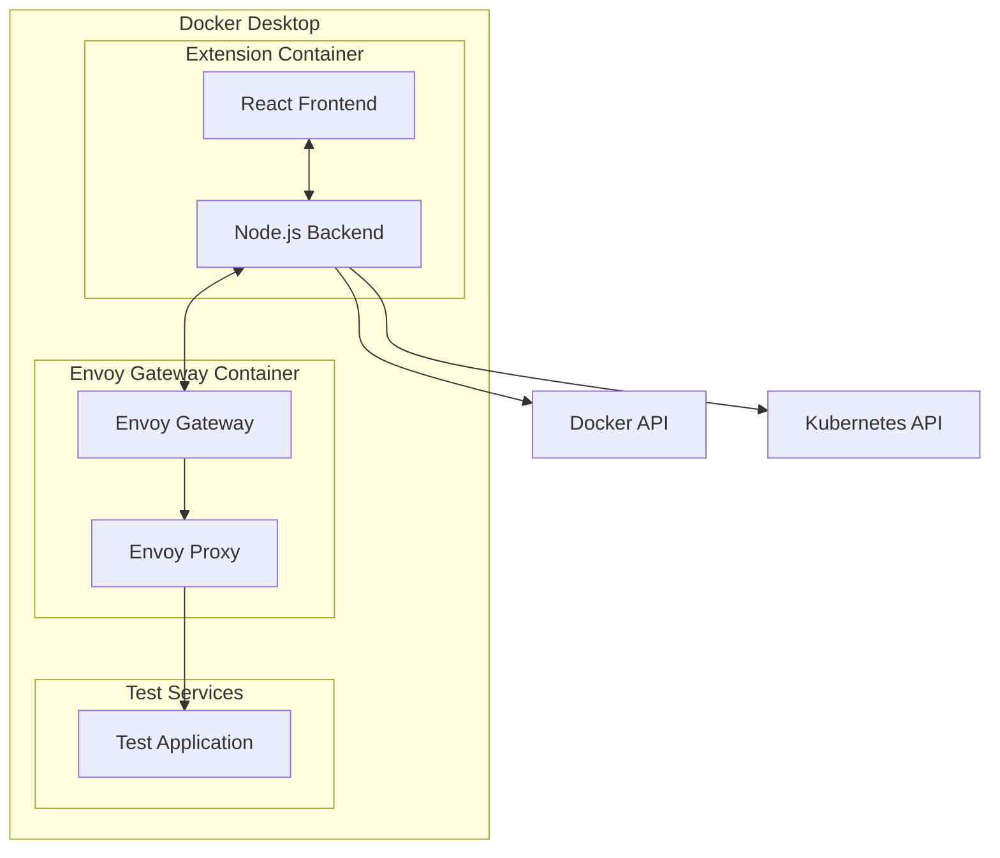

# Envoy Gateway Docker Desktop Extension - Implementation Guide

## Table of Contents
1. [Project Overview](#project-overview)
2. [Architecture](#architecture)
3. [Development Setup](#development-setup)
4. [Implementation Details](#implementation-details)
5. [Testing Strategy](#testing-strategy)
6. [Deployment](#deployment)
7. [Monitoring & Maintenance](#monitoring--maintenance)

---

## 1. Project Overview

### 1.1 Objective
Build a Docker Desktop Extension that simplifies Envoy Gateway development by providing visual configuration management, integrated testing, and real-time monitoring capabilities.

### 1.2 Key Components
- **Frontend UI**: React-based user interface using Material-UI
- **Backend Service**: Node.js service for Gateway API management
- **Envoy Gateway Integration**: Automated deployment and configuration
- **Testing Framework**: Integrated HTTP client and load testing tools
- **Monitoring Dashboard**: Real-time metrics and observability

### 1.3 Technology Stack
- **Frontend**: React 18+, TypeScript, Material-UI 5+
- **Backend**: Node.js 18+, Express.js, Docker SDK
- **Gateway**: Envoy Gateway 1.2+, Gateway API
- **Testing**: Jest, Cypress, Playwright
- **Build**: Docker, Webpack, GitHub Actions

---

## 2. Architecture

### 2.1 High-Level Architecture



### 2.2 Component Architecture

#### Frontend (React UI)
```typescript
src/
├── components/          # Reusable UI components
├── pages/              # Main application pages
├── hooks/              # Custom React hooks
├── services/           # API service layer
├── store/              # State management (Redux/Zustand)
├── types/              # TypeScript type definitions
└── utils/              # Utility functions
```

#### Backend (Node.js Service)
```typescript
src/
├── controllers/        # Route handlers
├── services/          # Business logic
├── middleware/        # Express middleware
├── models/           # Data models
├── utils/            # Utility functions
└── config/           # Configuration files
```

### 2.3 Data Flow

1. **User Interaction**: User configures Gateway resources through UI
2. **API Call**: Frontend sends configuration to backend via REST API
3. **Validation**: Backend validates Gateway API resources
4. **Deployment**: Backend applies configuration to Envoy Gateway
5. **Monitoring**: Real-time updates flow back to UI via WebSocket

---

## 3. Development Setup

### 3.1 Prerequisites

```bash
# Required tools
- Docker Desktop 4.8.0+
- Node.js 18+
- npm or yarn
- Git
- Docker Extensions CLI

# Install Docker Extensions CLI
curl -L https://github.com/docker/extensions-sdk/releases/latest/download/docker-extension-cli-desktop-linux.tar.gz | tar -xz
sudo mv docker-extension /usr/local/bin/
```

### 3.2 Project Initialization

```bash
# Clone and setup
git clone <repository-url>
cd envoy-gateway-docker-desktop-extension

# Install dependencies
npm install

# Setup development environment
npm run setup:dev
```

### 3.3 Directory Structure

```
envoy-gateway-docker-desktop-extension/
├── docs/                    # Documentation
│   ├── IMPLEMENTATION_GUIDE.md
│   ├── API_SPECIFICATION.md
│   ├── ARCHITECTURE.md
│   └── DEPLOYMENT.md
├── src/
│   ├── frontend/           # React application
│   ├── backend/            # Node.js service
│   └── shared/             # Shared utilities
├── config/
│   ├── envoy-gateway.yaml  # Default EG configuration
│   └── test-scenarios.json # Test scenarios
├── scripts/
│   ├── build.sh           # Build scripts
│   ├── test.sh            # Test scripts
│   └── deploy.sh          # Deployment scripts
├── tests/
│   ├── unit/              # Unit tests
│   ├── integration/       # Integration tests
│   └── e2e/              # End-to-end tests
├── Dockerfile
├── docker-compose.yml
├── metadata.json          # Extension metadata
└── package.json
```

---

## 4. Implementation Details

### 4.1 Phase 1: Core Infrastructure

#### 4.1.1 Extension Setup

Create the extension metadata file:

```json
// metadata.json
{
  "icon": "icon.svg",
  "vm": {
    "image": "envoy-gateway-extension:latest",
    "composefile": "docker-compose.yml"
  },
  "ui": {
    "dashboard-tab": {
      "title": "Envoy Gateway",
      "root": "/ui",
      "src": "dist/index.html"
    }
  }
}
```

#### 4.1.2 Docker Configuration

```dockerfile
# Dockerfile
FROM node:18-alpine as frontend-builder
WORKDIR /app/frontend
COPY src/frontend/package*.json ./
RUN npm ci
COPY src/frontend ./
RUN npm run build

FROM node:18-alpine as backend-builder
WORKDIR /app/backend
COPY src/backend/package*.json ./
RUN npm ci
COPY src/backend ./
RUN npm run build

FROM node:18-alpine
WORKDIR /app
COPY --from=backend-builder /app/backend/dist ./backend
COPY --from=frontend-builder /app/frontend/dist ./frontend
COPY package*.json ./
RUN npm ci --production
EXPOSE 3000
CMD ["npm", "start"]
```

### 4.2 Phase 2: Configuration Management

#### 4.2.1 Gateway API Resource Management

```typescript
// src/backend/services/GatewayService.ts
import { KubernetesApi } from '@kubernetes/client-node';

export class GatewayService {
  private k8sApi: KubernetesApi;

  async createGateway(config: GatewayConfig): Promise<Gateway> {
    const gateway = {
      apiVersion: 'gateway.networking.k8s.io/v1',
      kind: 'Gateway',
      metadata: {
        name: config.name,
        namespace: config.namespace || 'default'
      },
      spec: {
        gatewayClassName: 'eg',
        listeners: config.listeners
      }
    };

    return this.k8sApi.create(gateway);
  }

  async createHTTPRoute(config: HTTPRouteConfig): Promise<HTTPRoute> {
    const route = {
      apiVersion: 'gateway.networking.k8s.io/v1',
      kind: 'HTTPRoute',
      metadata: {
        name: config.name,
        namespace: config.namespace || 'default'
      },
      spec: {
        parentRefs: config.parentRefs,
        rules: config.rules
      }
    };

    return this.k8sApi.create(route);
  }
}
```

#### 4.2.2 Configuration Validation

```typescript
// src/shared/validators/GatewayValidator.ts
import Ajv from 'ajv';
import { gatewaySchema, httpRouteSchema } from './schemas';

export class GatewayValidator {
  private ajv: Ajv;

  constructor() {
    this.ajv = new Ajv({ allErrors: true });
  }

  validateGateway(config: any): ValidationResult {
    const validate = this.ajv.compile(gatewaySchema);
    const valid = validate(config);
    
    return {
      valid,
      errors: validate.errors || []
    };
  }

  validateHTTPRoute(config: any): ValidationResult {
    const validate = this.ajv.compile(httpRouteSchema);
    const valid = validate(config);
    
    return {
      valid,
      errors: validate.errors || []
    };
  }
}
```

### 4.3 Phase 3: Testing Framework

#### 4.3.1 HTTP Test Client

```typescript
// src/backend/services/TestClient.ts
import axios, { AxiosResponse } from 'axios';

export class HTTPTestClient {
  async executeTest(test: TestRequest): Promise<TestResult> {
    const startTime = Date.now();
    
    try {
      const response: AxiosResponse = await axios({
        method: test.method,
        url: test.url,
        headers: test.headers,
        data: test.body,
        timeout: test.timeout || 5000
      });

      return {
        success: true,
        statusCode: response.status,
        headers: response.headers,
        body: response.data,
        responseTime: Date.now() - startTime
      };
    } catch (error) {
      return {
        success: false,
        error: error.message,
        responseTime: Date.now() - startTime
      };
    }
  }

  async runLoadTest(config: LoadTestConfig): Promise<LoadTestResult> {
    const promises = [];
    const results: TestResult[] = [];

    for (let i = 0; i < config.concurrency; i++) {
      promises.push(this.runConcurrentRequests(config, results));
    }

    await Promise.all(promises);

    return this.aggregateResults(results);
  }
}
```

### 4.4 Phase 4: Monitoring Dashboard

#### 4.4.1 Metrics Collection

```typescript
// src/backend/services/MetricsService.ts
export class MetricsService {
  private prometheusClient: any;

  async getGatewayMetrics(): Promise<GatewayMetrics> {
    const metrics = await this.prometheusClient.query([
      'envoy_http_inbound_downstream_rq_total',
      'envoy_http_inbound_downstream_rq_time_bucket',
      'envoy_cluster_upstream_rq_total',
      'envoy_cluster_upstream_rq_pending_total'
    ]);

    return this.processMetrics(metrics);
  }

  async getAccessLogs(filter: LogFilter): Promise<AccessLog[]> {
    // Implementation for accessing Envoy access logs
    return this.fetchFilteredLogs(filter);
  }
}
```

#### 4.4.2 Real-time Updates

```typescript
// src/backend/services/WebSocketService.ts
import { WebSocketServer } from 'ws';

export class WebSocketService {
  private wss: WebSocketServer;
  private clients: Set<WebSocket> = new Set();

  constructor(port: number) {
    this.wss = new WebSocketServer({ port });
    this.setupWebSocket();
  }

  private setupWebSocket() {
    this.wss.on('connection', (ws) => {
      this.clients.add(ws);
      
      ws.on('close', () => {
        this.clients.delete(ws);
      });
    });
  }

  broadcastMetrics(metrics: any) {
    const message = JSON.stringify({
      type: 'metrics',
      data: metrics
    });

    this.clients.forEach(client => {
      if (client.readyState === WebSocket.OPEN) {
        client.send(message);
      }
    });
  }
}
```

### 4.5 Frontend Implementation

#### 4.5.1 Main Dashboard Component

```typescript
// src/frontend/components/Dashboard.tsx
import React, { useEffect, useState } from 'react';
import { Box, Grid, Paper, Typography } from '@mui/material';
import { GatewayStatusCard } from './GatewayStatusCard';
import { MetricsChart } from './MetricsChart';
import { useWebSocket } from '../hooks/useWebSocket';

export const Dashboard: React.FC = () => {
  const [metrics, setMetrics] = useState<GatewayMetrics | null>(null);
  const [gatewayStatus, setGatewayStatus] = useState<GatewayStatus | null>(null);

  const { lastMessage } = useWebSocket('/api/ws');

  useEffect(() => {
    if (lastMessage?.type === 'metrics') {
      setMetrics(lastMessage.data);
    }
  }, [lastMessage]);

  return (
    <Box p={3}>
      <Typography variant="h4" gutterBottom>
        Envoy Gateway Dashboard
      </Typography>
      
      <Grid container spacing={3}>
        <Grid item xs={12} md={6}>
          <GatewayStatusCard status={gatewayStatus} />
        </Grid>
        
        <Grid item xs={12} md={6}>
          <Paper p={2}>
            <MetricsChart metrics={metrics} />
          </Paper>
        </Grid>
      </Grid>
    </Box>
  );
};
```

#### 4.5.2 Configuration Editor

```typescript
// src/frontend/components/ConfigEditor.tsx
import React, { useState } from 'react';
import { Box, Button, Tab, Tabs } from '@mui/material';
import { YamlEditor } from './YamlEditor';
import { VisualEditor } from './VisualEditor';

export const ConfigEditor: React.FC = () => {
  const [activeTab, setActiveTab] = useState(0);
  const [config, setConfig] = useState<GatewayConfig | null>(null);

  const handleSave = async () => {
    try {
      await api.saveConfiguration(config);
      // Show success notification
    } catch (error) {
      // Show error notification
    }
  };

  return (
    <Box>
      <Tabs value={activeTab} onChange={(_, newValue) => setActiveTab(newValue)}>
        <Tab label="Visual Editor" />
        <Tab label="YAML Editor" />
      </Tabs>

      {activeTab === 0 && (
        <VisualEditor 
          config={config} 
          onChange={setConfig}
        />
      )}

      {activeTab === 1 && (
        <YamlEditor 
          config={config} 
          onChange={setConfig}
        />
      )}

      <Box mt={2}>
        <Button variant="contained" onClick={handleSave}>
          Save Configuration
        </Button>
      </Box>
    </Box>
  );
};
```

---

## 5. Testing Strategy

### 5.1 Unit Testing

```typescript
// tests/unit/services/GatewayService.test.ts
import { GatewayService } from '../../../src/backend/services/GatewayService';

describe('GatewayService', () => {
  let service: GatewayService;

  beforeEach(() => {
    service = new GatewayService();
  });

  test('should create gateway with valid configuration', async () => {
    const config = {
      name: 'test-gateway',
      namespace: 'default',
      listeners: [/* ... */]
    };

    const result = await service.createGateway(config);
    expect(result.metadata.name).toBe('test-gateway');
  });
});
```

### 5.2 Integration Testing

```typescript
// tests/integration/gateway.test.ts
import { setupTestEnvironment, teardownTestEnvironment } from '../utils/testSetup';

describe('Gateway Integration Tests', () => {
  beforeAll(async () => {
    await setupTestEnvironment();
  });

  afterAll(async () => {
    await teardownTestEnvironment();
  });

  test('should deploy and configure Envoy Gateway', async () => {
    // Test full deployment flow
  });
});
```

### 5.3 End-to-End Testing

```typescript
// tests/e2e/dashboard.spec.ts
import { test, expect } from '@playwright/test';

test('should display gateway status on dashboard', async ({ page }) => {
  await page.goto('/');
  await expect(page.locator('[data-testid="gateway-status"]')).toBeVisible();
  await expect(page.locator('[data-testid="metrics-chart"]')).toBeVisible();
});

test('should create and test HTTP route', async ({ page }) => {
  await page.goto('/config');
  await page.fill('[data-testid="route-name-input"]', 'test-route');
  await page.click('[data-testid="create-route-button"]');
  
  // Navigate to testing page
  await page.goto('/test');
  await page.fill('[data-testid="test-url-input"]', 'http://localhost/test');
  await page.click('[data-testid="send-request-button"]');
  
  await expect(page.locator('[data-testid="response-status"]')).toContainText('200');
});
```

---

## 6. Deployment

### 6.1 Build Process

```bash
#!/bin/bash
# scripts/build.sh

echo "Building Envoy Gateway Docker Desktop Extension..."

# Build frontend
cd src/frontend
npm run build

# Build backend
cd ../backend
npm run build

# Build Docker image
cd ../..
docker build -t envoy-gateway-extension:latest .

# Create extension package
docker extension pack envoy-gateway-extension:latest

echo "Build complete!"
```

### 6.2 Development Deployment

```bash
#!/bin/bash
# scripts/deploy-dev.sh

# Install extension in development mode
docker extension install envoy-gateway-extension:latest --force

# Enable debug mode
docker extension enable envoy-gateway-extension

echo "Extension deployed in development mode"
```

### 6.3 Production Deployment

```bash
#!/bin/bash
# scripts/deploy-prod.sh

# Tag for release
docker tag envoy-gateway-extension:latest envoyproxy/envoy-gateway-extension:v1.0.0

# Push to registry
docker push envoyproxy/envoy-gateway-extension:v1.0.0

# Update marketplace metadata
echo "Extension ready for marketplace submission"
```

---

## 7. Monitoring & Maintenance

### 7.1 Health Checks

```typescript
// src/backend/middleware/healthCheck.ts
export const healthCheck = async (req: Request, res: Response) => {
  const checks = {
    service: 'healthy',
    envoyGateway: await checkEnvoyGatewayHealth(),
    docker: await checkDockerConnection(),
    kubernetes: await checkKubernetesConnection()
  };

  const isHealthy = Object.values(checks).every(status => status === 'healthy');
  
  res.status(isHealthy ? 200 : 503).json(checks);
};
```

### 7.2 Logging

```typescript
// src/backend/utils/logger.ts
import winston from 'winston';

export const logger = winston.createLogger({
  level: process.env.LOG_LEVEL || 'info',
  format: winston.format.combine(
    winston.format.timestamp(),
    winston.format.errors({ stack: true }),
    winston.format.json()
  ),
  transports: [
    new winston.transports.Console(),
    new winston.transports.File({ filename: 'logs/error.log', level: 'error' }),
    new winston.transports.File({ filename: 'logs/combined.log' })
  ]
});
```

### 7.3 Error Handling

```typescript
// src/backend/middleware/errorHandler.ts
export const errorHandler = (error: Error, req: Request, res: Response, next: NextFunction) => {
  logger.error(error.stack);

  if (error instanceof ValidationError) {
    return res.status(400).json({
      error: 'Validation Error',
      details: error.details
    });
  }

  if (error instanceof NotFoundError) {
    return res.status(404).json({
      error: 'Resource Not Found',
      message: error.message
    });
  }

  res.status(500).json({
    error: 'Internal Server Error',
    message: 'An unexpected error occurred'
  });
};
```

---

## 8. Performance Optimization

### 8.1 Frontend Optimization

```typescript
// Lazy loading for better performance
const ConfigEditor = lazy(() => import('./components/ConfigEditor'));
const TestingPage = lazy(() => import('./pages/TestingPage'));
const MonitoringDashboard = lazy(() => import('./pages/MonitoringDashboard'));

// Memoization for expensive operations
const MemoizedMetricsChart = memo(MetricsChart);

// Virtual scrolling for large lists
const VirtualizedLogViewer = ({ logs }: { logs: LogEntry[] }) => {
  return (
    <FixedSizeList
      height={600}
      itemCount={logs.length}
      itemSize={35}
      itemData={logs}
    >
      {LogItem}
    </FixedSizeList>
  );
};
```

### 8.2 Backend Optimization

```typescript
// Connection pooling
const k8sConfig = new KubeConfig();
k8sConfig.loadFromDefault();

const k8sApi = k8sConfig.makeApiClient(CoreV1Api);
k8sApi.setDefaultAuthentication(new KubeConfig().currentContext.auth);

// Caching
const cache = new NodeCache({ stdTTL: 600 }); // 10-minute cache

export const cachedGetGatewayStatus = async (gatewayName: string) => {
  const cacheKey = `gateway-status-${gatewayName}`;
  const cached = cache.get(cacheKey);
  
  if (cached) {
    return cached;
  }
  
  const status = await getGatewayStatus(gatewayName);
  cache.set(cacheKey, status);
  return status;
};
```

---

## 9. Security Considerations

### 9.1 Authentication & Authorization

```typescript
// Role-based access control
export const requireRole = (role: string) => {
  return (req: Request, res: Response, next: NextFunction) => {
    const userRole = getUserRole(req);
    
    if (!hasPermission(userRole, role)) {
      return res.status(403).json({ error: 'Insufficient permissions' });
    }
    
    next();
  };
};

// API key validation
export const validateApiKey = (req: Request, res: Response, next: NextFunction) => {
  const apiKey = req.headers['x-api-key'];
  
  if (!isValidApiKey(apiKey)) {
    return res.status(401).json({ error: 'Invalid API key' });
  }
  
  next();
};
```

### 9.2 Input Validation

```typescript
// Schema validation middleware
export const validateRequest = (schema: JSONSchema7) => {
  return (req: Request, res: Response, next: NextFunction) => {
    const { error } = validate(req.body, schema);
    
    if (error) {
      return res.status(400).json({
        error: 'Validation Error',
        details: error.details
      });
    }
    
    next();
  };
};

// Sanitization
export const sanitizeInput = (input: string): string => {
  return DOMPurify.sanitize(input);
};
```

### 9.3 Secure Communication

```typescript
// HTTPS enforcement
app.use((req, res, next) => {
  if (req.header('x-forwarded-proto') !== 'https') {
    res.redirect(`https://${req.header('host')}${req.url}`);
  } else {
    next();
  }
});

// CORS configuration
app.use(cors({
  origin: process.env.ALLOWED_ORIGINS?.split(',') || ['http://localhost:3000'],
  credentials: true,
  methods: ['GET', 'POST', 'PUT', 'DELETE', 'OPTIONS'],
  allowedHeaders: ['Content-Type', 'Authorization', 'X-API-Key']
}));

// Security headers
app.use(helmet({
  contentSecurityPolicy: {
    directives: {
      defaultSrc: ["'self'"],
      scriptSrc: ["'self'", "'unsafe-inline'"],
      styleSrc: ["'self'", "'unsafe-inline'"],
      imgSrc: ["'self'", "data:", "https:"],
      connectSrc: ["'self'", "ws:", "wss:"]
    }
  }
}));
```

---

## 10. Troubleshooting Guide

### 10.1 Common Issues

#### Extension Won't Start
```bash
# Check Docker Desktop version
docker version

# Check extension status
docker extension ls

# View extension logs
docker extension logs envoy-gateway-extension
```

#### Gateway Deployment Fails
```bash
# Check Kubernetes context
kubectl config current-context

# Verify Envoy Gateway CRDs
kubectl get crd | grep gateway

# Check resource status
kubectl get gateway,httproute -A
```

#### Configuration Validation Errors
```bash
# Validate YAML syntax
cat config.yaml | docker run --rm -i mikefarah/yq:latest e '.'

# Check Gateway API schema
kubectl explain gateway.spec.listeners
```

### 10.2 Debug Mode

```typescript
// Enable debug logging
process.env.DEBUG = 'envoy-gateway-extension:*';

// Debug configuration
export const DEBUG_CONFIG = {
  enableVerboseLogging: process.env.NODE_ENV === 'development',
  logRequestResponse: true,
  enableMetricsDebug: true,
  saveDebugFiles: true
};
```

### 10.3 Performance Debugging

```typescript
// Performance monitoring
const performanceMiddleware = (req: Request, res: Response, next: NextFunction) => {
  const start = process.hrtime();
  
  res.on('finish', () => {
    const [seconds, nanoseconds] = process.hrtime(start);
    const duration = seconds * 1000 + nanoseconds / 1e6;
    
    logger.info(`${req.method} ${req.path} - ${res.statusCode} - ${duration.toFixed(2)}ms`);
  });
  
  next();
};

// Memory usage tracking
setInterval(() => {
  const usage = process.memoryUsage();
  logger.debug('Memory usage:', {
    rss: `${Math.round(usage.rss / 1024 / 1024 * 100) / 100} MB`,
    heapTotal: `${Math.round(usage.heapTotal / 1024 / 1024 * 100) / 100} MB`,
    heapUsed: `${Math.round(usage.heapUsed / 1024 / 1024 * 100) / 100} MB`,
    external: `${Math.round(usage.external / 1024 / 1024 * 100) / 100} MB`
  });
}, 30000); // Log every 30 seconds
```

---

## 11. Conclusion

This implementation guide provides a comprehensive roadmap for building the Envoy Gateway Docker Desktop Extension. Key points to remember:

1. **Modular Architecture**: Build components that can be developed and tested independently
2. **Progressive Enhancement**: Start with core features and add advanced capabilities incrementally
3. **User-Centric Design**: Focus on developer experience and workflow optimization
4. **Robust Testing**: Implement comprehensive testing at all levels
5. **Security First**: Implement security best practices from the beginning
6. **Performance Optimization**: Design for scale and responsiveness
7. **Comprehensive Monitoring**: Include observability and debugging capabilities

Follow this guide step-by-step to build a production-ready extension that significantly improves the Envoy Gateway development experience.

---

**Next Steps:**
1. Set up the development environment
2. Implement Phase 1 (Core Infrastructure)
3. Begin frontend development with basic components
4. Develop backend services incrementally
5. Integrate testing framework early
6. Continuously gather user feedback and iterate

For questions or clarifications, refer to the additional documentation files in this project or reach out to the Envoy Gateway community.
