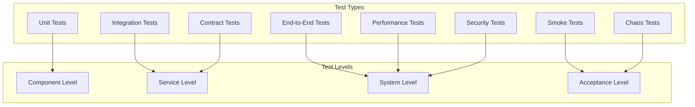
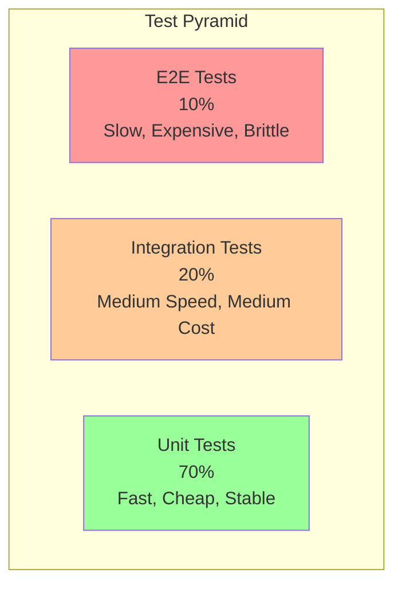

# Test Strategy - Envoy Gateway Docker Desktop Extension

## Table of Contents
1. [Testing Overview](#testing-overview)
2. [Test Pyramid](#test-pyramid)
3. [Unit Testing](#unit-testing)
4. [Integration Testing](#integration-testing)
5. [End-to-End Testing](#end-to-end-testing)
6. [Performance Testing](#performance-testing)
7. [Security Testing](#security-testing)
8. [Test Infrastructure](#test-infrastructure)
9. [CI/CD Integration](#cicd-integration)
10. [Quality Gates](#quality-gates)

---

## 1. Testing Overview

### 1.1 Testing Philosophy

Our testing strategy follows these core principles:

- **Shift Left**: Catch defects as early as possible in the development cycle
- **Fast Feedback**: Provide rapid feedback to developers
- **Confidence**: Build confidence in releases through comprehensive testing
- **Automation**: Automate tests to enable continuous delivery
- **Maintainability**: Write tests that are easy to understand and maintain

### 1.2 Quality Objectives

- **Code Coverage**: Maintain >90% line coverage for critical paths
- **Bug Detection**: Catch >95% of defects before production
- **Performance**: Ensure no regression in response times
- **Security**: Validate all security controls and boundaries
- **Reliability**: Achieve 99.9% uptime in production

### 1.3 Test Types



---

## 2. Test Pyramid

### 2.1 Test Distribution



### 2.2 Test Characteristics

| Test Type | Speed | Cost | Reliability | Feedback | Coverage |
|-----------|--------|------|-------------|----------|----------|
| Unit | Fast | Low | High | Immediate | Component |
| Integration | Medium | Medium | Medium | Quick | Service |
| E2E | Slow | High | Low | Delayed | System |

---

## 3. Unit Testing

### 3.1 Unit Test Strategy

Unit tests focus on testing individual components, functions, and classes in isolation.

#### Test Structure
```typescript
// Example unit test structure
describe('GatewayService', () => {
  let service: GatewayService;
  let mockK8sClient: jest.Mocked<KubernetesClient>;

  beforeEach(() => {
    mockK8sClient = createMockK8sClient();
    service = new GatewayService(mockK8sClient);
  });

  describe('createGateway', () => {
    it('should create gateway with valid configuration', async () => {
      // Arrange
      const config = createValidGatewayConfig();
      mockK8sClient.createCustomObject.mockResolvedValue(expectedGateway);

      // Act
      const result = await service.createGateway(config);

      // Assert
      expect(result).toEqual(expectedGateway);
      expect(mockK8sClient.createCustomObject).toHaveBeenCalledWith(
        'gateway.networking.k8s.io',
        'v1',
        'default',
        'gateways',
        expect.objectContaining({
          metadata: { name: config.name }
        })
      );
    });

    it('should throw error for invalid configuration', async () => {
      // Arrange
      const invalidConfig = createInvalidGatewayConfig();

      // Act & Assert
      await expect(service.createGateway(invalidConfig))
        .rejects.toThrow('Invalid gateway configuration');
    });
  });
});
```

### 3.2 Frontend Unit Testing

```typescript
// React component testing with React Testing Library
import { render, screen, fireEvent, waitFor } from '@testing-library/react';
import { Provider } from 'react-redux';
import { GatewayStatusCard } from '../GatewayStatusCard';
import { mockStore } from '../../test-utils/mockStore';

describe('GatewayStatusCard', () => {
  it('should display gateway status correctly', () => {
    const gatewayStatus = {
      name: 'test-gateway',
      status: 'running',
      health: 'healthy'
    };

    render(
      <Provider store={mockStore()}>
        <GatewayStatusCard status={gatewayStatus} />
      </Provider>
    );

    expect(screen.getByText('test-gateway')).toBeInTheDocument();
    expect(screen.getByText('Running')).toBeInTheDocument();
    expect(screen.getByTestId('health-indicator')).toHaveClass('healthy');
  });

  it('should handle refresh action', async () => {
    const onRefresh = jest.fn();
    render(
      <Provider store={mockStore()}>
        <GatewayStatusCard status={mockStatus} onRefresh={onRefresh} />
      </Provider>
    );

    fireEvent.click(screen.getByLabelText('Refresh'));
    await waitFor(() => {
      expect(onRefresh).toHaveBeenCalled();
    });
  });
});
```

### 3.3 Backend Unit Testing

```typescript
// Controller testing
import { Request, Response } from 'express';
import { GatewayController } from '../controllers/GatewayController';
import { GatewayService } from '../services/GatewayService';

describe('GatewayController', () => {
  let controller: GatewayController;
  let mockService: jest.Mocked<GatewayService>;
  let mockRequest: Partial<Request>;
  let mockResponse: Partial<Response>;

  beforeEach(() => {
    mockService = {
      createGateway: jest.fn(),
      getGatewayStatus: jest.fn(),
      deleteGateway: jest.fn()
    } as jest.Mocked<GatewayService>;

    controller = new GatewayController(mockService);

    mockRequest = {
      body: {},
      params: {},
      query: {}
    };

    mockResponse = {
      status: jest.fn().mockReturnThis(),
      json: jest.fn().mockReturnThis(),
      send: jest.fn().mockReturnThis()
    };
  });

  it('should create gateway successfully', async () => {
    const gatewayConfig = { name: 'test-gateway' };
    const createdGateway = { id: 'gw-123', ...gatewayConfig };

    mockRequest.body = gatewayConfig;
    mockService.createGateway.mockResolvedValue(createdGateway);

    await controller.createGateway(
      mockRequest as Request,
      mockResponse as Response
    );

    expect(mockService.createGateway).toHaveBeenCalledWith(gatewayConfig);
    expect(mockResponse.status).toHaveBeenCalledWith(201);
    expect(mockResponse.json).toHaveBeenCalledWith({
      status: 'success',
      data: createdGateway
    });
  });
});
```

### 3.4 Unit Test Tools

- **Frontend**: Jest + React Testing Library + MSW (Mock Service Worker)
- **Backend**: Jest + Supertest + Sinon for mocks
- **Utilities**: 
  - Factory pattern for test data creation
  - Custom matchers for domain-specific assertions
  - Test utilities for common setup/teardown

```typescript
// Test utilities example
export const testUtils = {
  createMockGateway: (overrides?: Partial<Gateway>): Gateway => ({
    metadata: {
      name: 'test-gateway',
      namespace: 'default',
      ...overrides?.metadata
    },
    spec: {
      gatewayClassName: 'eg',
      listeners: [
        {
          name: 'http',
          port: 80,
          protocol: 'HTTP'
        }
      ],
      ...overrides?.spec
    },
    status: {
      conditions: [],
      ...overrides?.status
    }
  }),

  createMockK8sClient: (): jest.Mocked<KubernetesClient> => ({
    createCustomObject: jest.fn(),
    getCustomObject: jest.fn(),
    patchCustomObject: jest.fn(),
    deleteCustomObject: jest.fn(),
    listCustomObjects: jest.fn()
  }),

  waitForCondition: async (
    condition: () => boolean | Promise<boolean>,
    timeout: number = 5000
  ): Promise<void> => {
    const start = Date.now();
    while (Date.now() - start < timeout) {
      if (await condition()) return;
      await new Promise(resolve => setTimeout(resolve, 100));
    }
    throw new Error(`Condition not met within ${timeout}ms`);
  }
};
```

---

## 4. Integration Testing

### 4.1 Integration Test Strategy

Integration tests verify that different components work correctly together.

#### Database Integration Tests

```typescript
// Database integration test example
describe('GatewayService Integration', () => {
  let service: GatewayService;
  let k8sTestClient: KubernetesClient;
  let testCluster: TestCluster;

  beforeAll(async () => {
    testCluster = await createTestCluster();
    k8sTestClient = testCluster.getClient();
    service = new GatewayService(k8sTestClient);
  });

  afterAll(async () => {
    await testCluster.cleanup();
  });

  it('should create and retrieve gateway from Kubernetes', async () => {
    const gatewayConfig = {
      name: 'integration-test-gateway',
      namespace: 'test-namespace'
    };

    // Create gateway
    const created = await service.createGateway(gatewayConfig);
    expect(created.metadata.name).toBe(gatewayConfig.name);

    // Verify it exists in Kubernetes
    const retrieved = await service.getGateway(
      gatewayConfig.name,
      gatewayConfig.namespace
    );
    expect(retrieved).toEqual(created);

    // Cleanup
    await service.deleteGateway(gatewayConfig.name, gatewayConfig.namespace);
  });
});
```

#### API Integration Tests

```typescript
// API integration test example
describe('Gateway API Integration', () => {
  let app: Express;
  let server: Server;
  let apiClient: APIClient;

  beforeAll(async () => {
    app = createTestApp();
    server = app.listen(0);
    const port = (server.address() as AddressInfo).port;
    apiClient = new APIClient(`http://localhost:${port}`);
  });

  afterAll(async () => {
    await server.close();
  });

  it('should handle complete gateway lifecycle', async () => {
    // Create gateway
    const createResponse = await apiClient.post('/api/v1/gateway', {
      name: 'test-gateway',
      mode: 'kubernetes'
    });
    expect(createResponse.status).toBe(201);
    const gatewayId = createResponse.data.id;

    // Wait for deployment
    await waitForGatewayReady(gatewayId);

    // Check status
    const statusResponse = await apiClient.get(`/api/v1/gateway/${gatewayId}/status`);
    expect(statusResponse.data.status).toBe('running');

    // Test route creation
    const routeResponse = await apiClient.post('/api/v1/config/httproute', {
      name: 'test-route',
      parentRefs: [{ name: 'test-gateway' }],
      rules: [/* route rules */]
    });
    expect(routeResponse.status).toBe(201);

    // Cleanup
    await apiClient.delete(`/api/v1/gateway/${gatewayId}`);
  });
});
```

### 4.2 Test Containers

Using testcontainers for integration testing:

```typescript
// Test containers setup
export class TestEnvironment {
  private containers: Map<string, StartedDockerComposeEnvironment>;

  async setup(): Promise<void> {
    // Start test environment with docker-compose
    const environment = await new DockerComposeEnvironment(
      './test/docker',
      'docker-compose.test.yml'
    ).up();

    this.containers.set('test-env', environment);

    // Wait for services to be ready
    await this.waitForServices();
  }

  async cleanup(): Promise<void> {
    for (const [, container] of this.containers) {
      await container.down();
    }
    this.containers.clear();
  }

  getServiceUrl(serviceName: string): string {
    const environment = this.containers.get('test-env');
    const container = environment.getContainer(serviceName);
    return `http://localhost:${container.getMappedPort(8080)}`;
  }

  private async waitForServices(): Promise<void> {
    const services = ['redis', 'envoy-gateway', 'prometheus'];
    
    for (const service of services) {
      await this.waitForHealthy(service);
    }
  }

  private async waitForHealthy(serviceName: string): Promise<void> {
    const url = `${this.getServiceUrl(serviceName)}/health`;
    
    await testUtils.waitForCondition(async () => {
      try {
        const response = await fetch(url);
        return response.ok;
      } catch {
        return false;
      }
    }, 30000);
  }
}
```

---

## 5. End-to-End Testing

### 5.1 E2E Test Strategy

End-to-end tests verify complete user workflows from the UI through the entire system.

#### Page Object Model

```typescript
// Page Object Model for E2E tests
export class DashboardPage {
  constructor(private page: Page) {}

  async navigateTo(): Promise<void> {
    await this.page.goto('/dashboard');
    await this.page.waitForSelector('[data-testid="dashboard-loaded"]');
  }

  async getGatewayStatus(): Promise<string> {
    return this.page.textContent('[data-testid="gateway-status"]');
  }

  async refreshGateway(): Promise<void> {
    await this.page.click('[data-testid="refresh-button"]');
    await this.page.waitForLoadState('networkidle');
  }

  async createNewGateway(name: string): Promise<void> {
    await this.page.click('[data-testid="create-gateway-button"]');
    await this.page.fill('[data-testid="gateway-name-input"]', name);
    await this.page.click('[data-testid="create-button"]');
    await this.page.waitForSelector(`[data-testid="gateway-${name}"]`);
  }
}

export class ConfigurationPage {
  constructor(private page: Page) {}

  async navigateTo(): Promise<void> {
    await this.page.goto('/configuration');
  }

  async createHTTPRoute(config: HTTPRouteConfig): Promise<void> {
    await this.page.click('[data-testid="create-route-button"]');
    
    // Fill in configuration
    await this.page.fill('[data-testid="route-name"]', config.name);
    await this.page.selectOption('[data-testid="parent-gateway"]', config.gateway);
    
    // Add rules
    for (const rule of config.rules) {
      await this.addRule(rule);
    }
    
    await this.page.click('[data-testid="save-route"]');
    await this.page.waitForSelector(`[data-testid="route-${config.name}"]`);
  }

  private async addRule(rule: RouteRule): Promise<void> {
    await this.page.click('[data-testid="add-rule-button"]');
    await this.page.fill('[data-testid="path-match"]', rule.path);
    await this.page.fill('[data-testid="backend-service"]', rule.backend);
  }
}
```

#### E2E Test Scenarios

```typescript
// Complete user journey test
describe('Complete Gateway Configuration Journey', () => {
  let browser: Browser;
  let page: Page;
  let dashboardPage: DashboardPage;
  let configPage: ConfigurationPage;
  let testingPage: TestingPage;

  beforeAll(async () => {
    browser = await chromium.launch();
    page = await browser.newPage();
    dashboardPage = new DashboardPage(page);
    configPage = new ConfigurationPage(page);
    testingPage = new TestingPage(page);
  });

  afterAll(async () => {
    await browser.close();
  });

  it('should complete full gateway setup and testing workflow', async () => {
    // 1. Navigate to dashboard and create gateway
    await dashboardPage.navigateTo();
    await dashboardPage.createNewGateway('e2e-test-gateway');
    
    // 2. Verify gateway is running
    await expect(dashboardPage.getGatewayStatus()).resolves.toBe('Running');
    
    // 3. Configure HTTP route
    await configPage.navigateTo();
    await configPage.createHTTPRoute({
      name: 'test-route',
      gateway: 'e2e-test-gateway',
      rules: [{
        path: '/api/test',
        backend: 'test-service'
      }]
    });
    
    // 4. Test the configuration
    await testingPage.navigateTo();
    await testingPage.executeTest({
      method: 'GET',
      url: 'http://localhost:8080/api/test'
    });
    
    // 5. Verify test results
    const results = await testingPage.getLatestTestResults();
    expect(results.statusCode).toBe(200);
    expect(results.success).toBe(true);
    
    // 6. Check monitoring dashboard
    await dashboardPage.navigateTo();
    const metrics = await dashboardPage.getMetrics();
    expect(metrics.requestCount).toBeGreaterThan(0);
  });
});
```

#### Visual Regression Testing

```typescript
// Visual regression testing
describe('Visual Regression Tests', () => {
  it('should match dashboard screenshot', async ({ page }) => {
    await page.goto('/dashboard');
    await page.waitForLoadState('networkidle');
    
    // Hide dynamic elements
    await page.addStyleTag({
      content: `
        [data-testid="timestamp"],
        [data-testid="live-metrics"] {
          visibility: hidden;
        }
      `
    });
    
    await expect(page).toHaveScreenshot('dashboard.png');
  });

  it('should match configuration page layout', async ({ page }) => {
    await page.goto('/configuration');
    await page.waitForSelector('[data-testid="config-loaded"]');
    
    await expect(page).toHaveScreenshot('configuration.png');
  });
});
```

### 5.2 E2E Test Tools

- **Browser Automation**: Playwright
- **Docker Orchestration**: Docker Compose + Testcontainers
- **Data Management**: Test data factories + fixtures
- **Assertions**: Custom matchers for domain logic
- **Reporting**: Allure for detailed test reports

---

## 6. Performance Testing

### 6.1 Performance Test Strategy

Performance tests ensure the extension meets response time and throughput requirements.

#### Load Testing

```typescript
// Load testing with Artillery
export const loadTestConfig = {
  config: {
    target: 'http://localhost:3000',
    phases: [
      { duration: '2m', arrivalRate: 10 }, // Warm up
      { duration: '5m', arrivalRate: 50 }, // Normal load
      { duration: '2m', arrivalRate: 100 }, // Peak load
      { duration: '1m', arrivalRate: 200 }  // Stress test
    ],
    defaults: {
      headers: {
        'Content-Type': 'application/json',
        'Authorization': 'Bearer {{token}}'
      }
    }
  },
  scenarios: [
    {
      name: 'API Load Test',
      weight: 100,
      flow: [
        { post: {
            url: '/api/v1/auth/login',
            json: {
              username: 'testuser',
              password: 'password'
            },
            capture: {
              json: '$.token',
              as: 'token'
            }
          }
        },
        { get: { url: '/api/v1/gateway' } },
        { post: {
            url: '/api/v1/test/http',
            json: {
              method: 'GET',
              url: 'http://localhost:8080/health'
            }
          }
        },
        { get: { url: '/api/v1/monitor/metrics' } }
      ]
    }
  ]
};
```

#### Benchmark Testing

```typescript
// Benchmark specific operations
describe('Performance Benchmarks', () => {
  beforeAll(async () => {
    await setupTestEnvironment();
  });

  it('should handle gateway creation within SLA', async () => {
    const iterations = 100;
    const results: number[] = [];

    for (let i = 0; i < iterations; i++) {
      const start = Date.now();
      
      await gatewayService.createGateway({
        name: `perf-test-${i}`,
        namespace: 'default'
      });
      
      const duration = Date.now() - start;
      results.push(duration);
      
      // Cleanup
      await gatewayService.deleteGateway(`perf-test-${i}`, 'default');
    }

    const average = results.reduce((a, b) => a + b) / results.length;
    const p95 = calculatePercentile(results, 95);
    const p99 = calculatePercentile(results, 99);

    expect(average).toBeLessThan(2000); // 2s average
    expect(p95).toBeLessThan(5000);     // 5s 95th percentile
    expect(p99).toBeLessThan(10000);    // 10s 99th percentile
  });

  it('should handle concurrent requests efficiently', async () => {
    const concurrency = 50;
    const requestsPerWorker = 10;

    const workers = Array(concurrency).fill(0).map(async (_, i) => {
      const results = [];
      
      for (let j = 0; j < requestsPerWorker; j++) {
        const start = Date.now();
        await apiClient.get('/api/v1/gateway');
        results.push(Date.now() - start);
      }
      
      return results;
    });

    const allResults = (await Promise.all(workers)).flat();
    const average = allResults.reduce((a, b) => a + b) / allResults.length;

    expect(average).toBeLessThan(500); // 500ms average under load
  });
});
```

#### Memory and Resource Testing

```typescript
// Memory leak detection
describe('Memory Usage Tests', () => {
  it('should not leak memory during normal operations', async () => {
    const initialMemory = process.memoryUsage().heapUsed;
    const iterations = 1000;

    // Perform operations that might leak memory
    for (let i = 0; i < iterations; i++) {
      await performMemoryIntensiveOperation();
      
      // Force garbage collection periodically
      if (i % 100 === 0 && global.gc) {
        global.gc();
      }
    }

    // Force final garbage collection
    if (global.gc) {
      global.gc();
    }

    const finalMemory = process.memoryUsage().heapUsed;
    const memoryGrowth = finalMemory - initialMemory;
    const growthPerIteration = memoryGrowth / iterations;

    // Memory growth should be minimal
    expect(growthPerIteration).toBeLessThan(1024); // Less than 1KB per operation
  });
});
```

### 6.2 Performance Monitoring

```typescript
// Performance monitoring utilities
export class PerformanceMonitor {
  private markers: Map<string, number> = new Map();

  mark(name: string): void {
    this.markers.set(name, performance.now());
  }

  measure(name: string, startMark: string): number {
    const start = this.markers.get(startMark);
    if (!start) {
      throw new Error(`Start mark '${startMark}' not found`);
    }

    const duration = performance.now() - start;
    console.log(`${name}: ${duration.toFixed(2)}ms`);
    return duration;
  }

  async profile<T>(name: string, fn: () => Promise<T>): Promise<T> {
    const start = performance.now();
    try {
      return await fn();
    } finally {
      const duration = performance.now() - start;
      console.log(`${name}: ${duration.toFixed(2)}ms`);
    }
  }
}

// Usage in tests
const monitor = new PerformanceMonitor();

test('profile API call performance', async () => {
  const result = await monitor.profile('API Call', async () => {
    return await apiClient.get('/api/v1/gateway');
  });

  expect(result.status).toBe(200);
});
```

---

## 7. Security Testing

### 7.1 Security Test Categories

#### Authentication & Authorization Testing

```typescript
// Authentication tests
describe('Authentication Security', () => {
  it('should reject requests without valid token', async () => {
    const response = await apiClient.get('/api/v1/gateway', {
      headers: {} // No authorization header
    });

    expect(response.status).toBe(401);
    expect(response.data.error).toBe('No token provided');
  });

  it('should reject expired tokens', async () => {
    const expiredToken = jwt.sign(
      { userId: 'test' },
      'secret',
      { expiresIn: '-1h' } // Expired 1 hour ago
    );

    const response = await apiClient.get('/api/v1/gateway', {
      headers: { Authorization: `Bearer ${expiredToken}` }
    });

    expect(response.status).toBe(401);
    expect(response.data.error).toBe('Token expired');
  });

  it('should enforce role-based access control', async () => {
    const viewerToken = createTokenWithRole('viewer');
    
    const response = await apiClient.post('/api/v1/gateway', gatewayConfig, {
      headers: { Authorization: `Bearer ${viewerToken}` }
    });

    expect(response.status).toBe(403);
    expect(response.data.error).toBe('Insufficient permissions');
  });
});
```

#### Input Validation Testing

```typescript
// Input validation and injection tests
describe('Input Security', () => {
  it('should sanitize XSS attempts', async () => {
    const maliciousInput = '<script>alert("xss")</script>';
    
    const response = await apiClient.post('/api/v1/config/gateway', {
      name: maliciousInput,
      namespace: 'default'
    });

    // Should be rejected due to validation
    expect(response.status).toBe(400);
    expect(response.data.error).toContain('Invalid name format');
  });

  it('should prevent SQL injection in filters', async () => {
    const sqlInjection = "'; DROP TABLE gateways; --";
    
    const response = await apiClient.get('/api/v1/gateway', {
      params: { filter: sqlInjection }
    });

    // Should handle gracefully without crashing
    expect(response.status).toBeLessThan(500);
  });

  it('should validate YAML injection attempts', async () => {
    const maliciousYaml = `
      name: test
      !!python/object/apply:os.system ["rm -rf /"]
    `;

    const response = await apiClient.post('/api/v1/config/validate', {
      yaml: maliciousYaml
    });

    expect(response.status).toBe(400);
    expect(response.data.error).toContain('Invalid YAML');
  });
});
```

#### Container Security Testing

```typescript
// Container security tests
describe('Container Security', () => {
  it('should run with non-root user', async () => {
    const containerInfo = await docker.getContainer('envoy-gateway-extension').inspect();
    const config = containerInfo.Config;

    expect(config.User).not.toBe('0');
    expect(config.User).not.toBe('root');
  });

  it('should have read-only root filesystem', async () => {
    const containerInfo = await docker.getContainer('envoy-gateway-extension').inspect();
    const hostConfig = containerInfo.HostConfig;

    expect(hostConfig.ReadonlyRootfs).toBe(true);
  });

  it('should have proper resource limits', async () => {
    const containerInfo = await docker.getContainer('envoy-gateway-extension').inspect();
    const hostConfig = containerInfo.HostConfig;

    expect(hostConfig.Memory).toBeGreaterThan(0);
    expect(hostConfig.CpuShares).toBeGreaterThan(0);
  });
});
```

### 7.2 Security Test Tools

- **Static Analysis**: ESLint security rules, Semgrep
- **Dependency Scanning**: npm audit, Snyk
- **Container Scanning**: Trivy, Anchore
- **Penetration Testing**: OWASP ZAP integration
- **Secrets Detection**: GitLeaks, TruffleHog

---

## 8. Test Infrastructure

### 8.1 Test Environment Management

```typescript
// Test environment configuration
export class TestEnvironment {
  private static instance: TestEnvironment;
  private containers: Map<string, GenericContainer> = new Map();

  static async getInstance(): Promise<TestEnvironment> {
    if (!TestEnvironment.instance) {
      TestEnvironment.instance = new TestEnvironment();
      await TestEnvironment.instance.initialize();
    }
    return TestEnvironment.instance;
  }

  private async initialize(): Promise<void> {
    // Start Redis for caching
    const redis = await new GenericContainer('redis:7-alpine')
      .withExposedPorts(6379)
      .start();
    this.containers.set('redis', redis);

    // Start test Kubernetes cluster (kind)
    const kind = await new GenericContainer('kindest/node:v1.27.3')
      .withPrivilegedMode()
      .withExposedPorts(6443)
      .start();
    this.containers.set('kubernetes', kind);

    // Start Envoy Gateway
    const envoyGateway = await new GenericContainer('envoyproxy/gateway:v1.2.0')
      .withEnvironment({
        'ENVOY_GATEWAY_NAMESPACES': 'default,test'
      })
      .withExposedPorts(8080, 8443)
      .start();
    this.containers.set('envoy-gateway', envoyGateway);

    // Wait for services to be ready
    await this.waitForServices();
  }

  async cleanup(): Promise<void> {
    for (const [, container] of this.containers) {
      await container.stop();
    }
    this.containers.clear();
  }

  getServiceUrl(service: string): string {
    const container = this.containers.get(service);
    if (!container) {
      throw new Error(`Service ${service} not found`);
    }

    const port = service === 'redis' ? 6379 : 8080;
    return `http://localhost:${container.getMappedPort(port)}`;
  }
}
```

### 8.2 Test Data Management

```typescript
// Test data factories
export class TestDataFactory {
  static createGateway(overrides?: Partial<Gateway>): Gateway {
    return {
      metadata: {
        name: `test-gateway-${randomId()}`,
        namespace: 'default',
        labels: {
          'app': 'envoy-gateway-extension',
          'test': 'true'
        },
        ...overrides?.metadata
      },
      spec: {
        gatewayClassName: 'eg',
        listeners: [
          {
            name: 'http',
            port: 80,
            protocol: 'HTTP',
            allowedRoutes: {
              namespaces: {
                from: 'All'
              }
            }
          }
        ],
        ...overrides?.spec
      },
      status: {
        conditions: [],
        addresses: [],
        ...overrides?.status
      }
    };
  }

  static createHTTPRoute(gatewayName: string, overrides?: Partial<HTTPRoute>): HTTPRoute {
    return {
      metadata: {
        name: `test-route-${randomId()}`,
        namespace: 'default',
        ...overrides?.metadata
      },
      spec: {
        parentRefs: [
          {
            name: gatewayName,
            namespace: 'default'
          }
        ],
        hostnames: [`${randomId()}.example.com`],
        rules: [
          {
            matches: [
              {
                path: {
                  type: 'PathPrefix',
                  value: '/api'
                }
              }
            ],
            backendRefs: [
              {
                name: 'test-service',
                port: 8080
              }
            ]
          }
        ],
        ...overrides?.spec
      },
      status: {
        parents: [],
        ...overrides?.status
      }
    };
  }

  static createTestUser(role: string = 'developer'): TestUser {
    return {
      id: randomId(),
      username: `testuser-${randomId()}`,
      role,
      permissions: this.getPermissionsForRole(role),
      token: this.generateTestToken(role)
    };
  }

  private static generateTestToken(role: string): string {
    return jwt.sign(
      { userId: randomId(), role },
      process.env.JWT_SECRET || 'test-secret',
      { expiresIn: '1h' }
    );
  }

  private static getPermissionsForRole(role: string): string[] {
    const permissions = {
      'admin': ['*'],
      'developer': ['gateway:read', 'gateway:write', 'config:read', 'config:write'],
      'viewer': ['gateway:read', 'config:read']
    };

    return permissions[role] || [];
  }
}

// Random ID generator
function randomId(): string {
  return Math.random().toString(36).substring(2, 15);
}
```

### 8.3 Test Utilities

```typescript
// Common test utilities
export const testUtils = {
  // Retry utility for flaky operations
  async retry<T>(
    operation: () => Promise<T>,
    maxAttempts: number = 3,
    delay: number = 1000
  ): Promise<T> {
    let lastError: Error;

    for (let attempt = 1; attempt <= maxAttempts; attempt++) {
      try {
        return await operation();
      } catch (error) {
        lastError = error as Error;
        
        if (attempt === maxAttempts) {
          throw lastError;
        }

        await new Promise(resolve => setTimeout(resolve, delay * attempt));
      }
    }

    throw lastError!;
  },

  // Wait for condition with timeout
  async waitForCondition(
    condition: () => boolean | Promise<boolean>,
    timeout: number = 10000,
    interval: number = 100
  ): Promise<void> {
    const start = Date.now();

    while (Date.now() - start < timeout) {
      if (await condition()) {
        return;
      }
      await new Promise(resolve => setTimeout(resolve, interval));
    }

    throw new Error(`Condition not met within ${timeout}ms`);
  },

  // Deep comparison with helpful diff
  expectDeepEqual<T>(actual: T, expected: T): void {
    try {
      expect(actual).toEqual(expected);
    } catch (error) {
      const diff = JSON.stringify({
        actual,
        expected,
        diff: require('jest-diff')(expected, actual)
      }, null, 2);
      
      throw new Error(`Deep comparison failed:\n${diff}`);
    }
  },

  // Create test context with cleanup
  async withTestContext<T>(
    setup: () => Promise<T>,
    test: (context: T) => Promise<void>,
    cleanup?: (context: T) => Promise<void>
  ): Promise<void> {
    let context: T;

    try {
      context = await setup();
      await test(context);
    } finally {
      if (context && cleanup) {
        await cleanup(context);
      }
    }
  }
};
```

---

## 9. CI/CD Integration

### 9.1 GitHub Actions Workflow

```yaml
# .github/workflows/test.yml
name: Test Suite

on:
  push:
    branches: [ main, develop ]
  pull_request:
    branches: [ main ]

jobs:
  unit-tests:
    runs-on: ubuntu-latest
    strategy:
      matrix:
        node-version: [18, 20]
    
    steps:
    - uses: actions/checkout@v3
    
    - name: Setup Node.js
      uses: actions/setup-node@v3
      with:
        node-version: ${{ matrix.node-version }}
        cache: 'npm'
    
    - name: Install dependencies
      run: npm ci
    
    - name: Run linting
      run: npm run lint
    
    - name: Run unit tests
      run: npm run test:unit
    
    - name: Generate coverage report
      run: npm run test:coverage
    
    - name: Upload coverage to Codecov
      uses: codecov/codecov-action@v3
      with:
        file: ./coverage/lcov.info

  integration-tests:
    runs-on: ubuntu-latest
    needs: unit-tests
    
    services:
      redis:
        image: redis:7-alpine
        ports:
          - 6379:6379
        options: >-
          --health-cmd "redis-cli ping"
          --health-interval 10s
          --health-timeout 5s
          --health-retries 5
    
    steps:
    - uses: actions/checkout@v3
    
    - name: Setup Node.js
      uses: actions/setup-node@v3
      with:
        node-version: 18
        cache: 'npm'
    
    - name: Install dependencies
      run: npm ci
    
    - name: Start test environment
      run: |
        docker-compose -f docker-compose.test.yml up -d
        npm run wait-for-services
    
    - name: Run integration tests
      run: npm run test:integration
      env:
        REDIS_URL: redis://localhost:6379
    
    - name: Cleanup test environment
      run: docker-compose -f docker-compose.test.yml down

  e2e-tests:
    runs-on: ubuntu-latest
    needs: integration-tests
    
    steps:
    - uses: actions/checkout@v3
    
    - name: Setup Node.js
      uses: actions/setup-node@v3
      with:
        node-version: 18
        cache: 'npm'
    
    - name: Install dependencies
      run: npm ci
    
    - name: Install Playwright
      run: npx playwright install --with-deps chromium
    
    - name: Start application
      run: |
        npm run build
        npm start &
        npm run wait-for-app
    
    - name: Run E2E tests
      run: npm run test:e2e
    
    - name: Upload Playwright report
      uses: actions/upload-artifact@v3
      if: always()
      with:
        name: playwright-report
        path: playwright-report/

  security-tests:
    runs-on: ubuntu-latest
    
    steps:
    - uses: actions/checkout@v3
    
    - name: Run security audit
      run: npm audit --audit-level moderate
    
    - name: Run dependency check
      uses: snyk/actions/node@master
      env:
        SNYK_TOKEN: ${{ secrets.SNYK_TOKEN }}
      with:
        args: --severity-threshold=high
    
    - name: Run Semgrep
      uses: returntocorp/semgrep-action@v1
      with:
        publishToken: ${{ secrets.SEMGREP_TOKEN }}

  performance-tests:
    runs-on: ubuntu-latest
    if: github.event_name == 'push' && github.ref == 'refs/heads/main'
    
    steps:
    - uses: actions/checkout@v3
    
    - name: Setup Node.js
      uses: actions/setup-node@v3
      with:
        node-version: 18
        cache: 'npm'
    
    - name: Install dependencies
      run: npm ci
    
    - name: Build application
      run: npm run build
    
    - name: Run performance tests
      run: npm run test:performance
    
    - name: Upload performance results
      uses: actions/upload-artifact@v3
      with:
        name: performance-results
        path: performance-results/
```

### 9.2 Test Reporting

```typescript
// Custom test reporter
export class CustomTestReporter {
  private results: TestResult[] = [];

  onRunStart(): void {
    console.log('🚀 Starting test suite...');
  }

  onTestStart(test: Test): void {
    console.log(`  Running: ${test.name}`);
  }

  onTestComplete(test: Test, result: TestResult): void {
    this.results.push(result);
    
    const icon = result.status === 'passed' ? '✅' : '❌';
    const duration = result.duration.toFixed(2);
    console.log(`  ${icon} ${test.name} (${duration}ms)`);
  }

  onRunComplete(): void {
    const summary = this.generateSummary();
    console.log('\n📊 Test Summary:');
    console.log(summary);
    
    // Generate detailed report
    this.generateHTMLReport();
    this.generateJUnitReport();
  }

  private generateSummary(): string {
    const total = this.results.length;
    const passed = this.results.filter(r => r.status === 'passed').length;
    const failed = total - passed;
    const totalTime = this.results.reduce((sum, r) => sum + r.duration, 0);

    return `
    Total: ${total}
    Passed: ${passed}
    Failed: ${failed}
    Duration: ${totalTime.toFixed(2)}ms
    Success Rate: ${((passed / total) * 100).toFixed(2)}%
    `;
  }

  private generateHTMLReport(): void {
    const report = `
    <!DOCTYPE html>
    <html>
    <head>
      <title>Test Report</title>
      <style>
        body { font-family: Arial, sans-serif; }
        .passed { color: green; }
        .failed { color: red; }
        .summary { background: #f0f0f0; padding: 20px; margin: 20px 0; }
      </style>
    </head>
    <body>
      <h1>Test Report</h1>
      <div class="summary">
        ${this.generateSummary()}
      </div>
      <table>
        <thead>
          <tr>
            <th>Test Name</th>
            <th>Status</th>
            <th>Duration</th>
            <th>Error</th>
          </tr>
        </thead>
        <tbody>
          ${this.results.map(result => `
            <tr class="${result.status}">
              <td>${result.name}</td>
              <td>${result.status}</td>
              <td>${result.duration.toFixed(2)}ms</td>
              <td>${result.error || ''}</td>
            </tr>
          `).join('')}
        </tbody>
      </table>
    </body>
    </html>
    `;

    fs.writeFileSync('test-report.html', report);
  }
}
```

---

## 10. Quality Gates

### 10.1 Quality Metrics

#### Code Coverage Gates
- **Unit Tests**: Minimum 90% line coverage
- **Integration Tests**: Minimum 80% line coverage
- **E2E Tests**: Minimum 70% user journey coverage

#### Performance Gates
- **Response Time**: 95th percentile < 500ms
- **Throughput**: > 100 requests/second
- **Memory Usage**: < 512MB under normal load
- **CPU Usage**: < 80% under peak load

#### Security Gates
- **No High/Critical vulnerabilities** in dependencies
- **All security tests passing**
- **No secrets in code** (verified by GitLeaks)
- **Container security** baseline compliance

### 10.2 Quality Gate Implementation

```typescript
// Quality gate checker
export class QualityGate {
  private readonly thresholds = {
    coverage: {
      unit: 90,
      integration: 80,
      e2e: 70
    },
    performance: {
      responseTimeP95: 500,
      throughput: 100,
      memoryUsageMB: 512,
      cpuUsagePercent: 80
    },
    security: {
      maxVulnerabilityLevel: 'medium'
    }
  };

  async check(): Promise<QualityGateResult> {
    const results = await Promise.all([
      this.checkCoverage(),
      this.checkPerformance(),
      this.checkSecurity(),
      this.checkTests()
    ]);

    const passed = results.every(result => result.passed);
    
    return {
      passed,
      results,
      summary: this.generateSummary(results)
    };
  }

  private async checkCoverage(): Promise<QualityCheck> {
    const coverage = await this.getCoverageReport();
    
    const checks = [
      {
        name: 'Unit Test Coverage',
        passed: coverage.unit >= this.thresholds.coverage.unit,
        actual: coverage.unit,
        expected: this.thresholds.coverage.unit
      },
      {
        name: 'Integration Test Coverage',
        passed: coverage.integration >= this.thresholds.coverage.integration,
        actual: coverage.integration,
        expected: this.thresholds.coverage.integration
      }
    ];

    return {
      category: 'Coverage',
      passed: checks.every(c => c.passed),
      checks
    };
  }

  private async checkPerformance(): Promise<QualityCheck> {
    const metrics = await this.getPerformanceMetrics();
    
    const checks = [
      {
        name: 'Response Time P95',
        passed: metrics.responseTimeP95 <= this.thresholds.performance.responseTimeP95,
        actual: metrics.responseTimeP95,
        expected: this.thresholds.performance.responseTimeP95
      },
      {
        name: 'Memory Usage',
        passed: metrics.memoryUsageMB <= this.thresholds.performance.memoryUsageMB,
        actual: metrics.memoryUsageMB,
        expected: this.thresholds.performance.memoryUsageMB
      }
    ];

    return {
      category: 'Performance',
      passed: checks.every(c => c.passed),
      checks
    };
  }

  private async checkSecurity(): Promise<QualityCheck> {
    const vulnerabilities = await this.getSecurityReport();
    
    const highOrCritical = vulnerabilities.filter(v => 
      v.severity === 'high' || v.severity === 'critical'
    );

    return {
      category: 'Security',
      passed: highOrCritical.length === 0,
      checks: [
        {
          name: 'No High/Critical Vulnerabilities',
          passed: highOrCritical.length === 0,
          actual: highOrCritical.length,
          expected: 0
        }
      ]
    };
  }
}

// Integration with CI/CD
export class CIPipeline {
  async runQualityGates(): Promise<void> {
    const qualityGate = new QualityGate();
    const result = await qualityGate.check();

    console.log('🔍 Quality Gate Results:');
    console.log(result.summary);

    if (!result.passed) {
      console.error('❌ Quality gates failed!');
      process.exit(1);
    }

    console.log('✅ All quality gates passed!');
  }
}
```

### 10.3 Branch Protection Rules

Configure GitHub branch protection with the following rules:

```yaml
# Branch protection configuration
protection_rules:
  main:
    required_status_checks:
      strict: true
      contexts:
        - "unit-tests"
        - "integration-tests"
        - "e2e-tests"
        - "security-tests"
        - "quality-gate"
    
    enforce_admins: true
    required_pull_request_reviews:
      required_approving_review_count: 2
      dismiss_stale_reviews: true
      require_code_owner_reviews: true
    
    restrictions:
      users: []
      teams: ["core-team"]
    
    allow_force_pushes: false
    allow_deletions: false

  develop:
    required_status_checks:
      strict: true
      contexts:
        - "unit-tests"
        - "integration-tests"
    
    required_pull_request_reviews:
      required_approving_review_count: 1
      dismiss_stale_reviews: true
```

---

## Conclusion

This comprehensive test strategy ensures the Envoy Gateway Docker Desktop Extension is:

1. **Reliable**: Thorough testing at all levels catches defects early
2. **Performant**: Load and stress testing validate scalability
3. **Secure**: Security tests protect against vulnerabilities
4. **Maintainable**: Well-structured tests support refactoring
5. **Quality**: Quality gates ensure consistent high standards

The strategy provides:
- **Fast Feedback**: Unit tests run in seconds
- **Confidence**: Integration tests verify component interaction
- **User Focus**: E2E tests validate user workflows
- **Production Readiness**: Performance and security testing ensure reliability

Regular review and updates of this test strategy will ensure it continues to meet the evolving needs of the project and maintains high quality standards.
